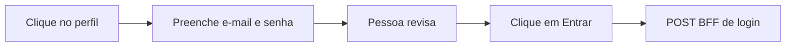

# Relatório — Painel de acesso rápido no login (aluno e responsável)

**Data:** 2026-09-21  
**Repo-alvo:** `akili-site`  
**Referência já pronta:** `akili-admin` (painel de testes em `/signin` para perfis escolares)

Este documento descreve **como replicar no portal** o painel de acesso rápido implementado no admin: um botão por perfil, que **preenche e-mail e senha sem enviar o formulário**. A pessoa confirma com **Entrar**.

No site, os perfis são **Responsável** e **Aluno**. Não incluir admin, coordenação, professor nem contas pessoais.

---

## 1. O que já existe no admin (copiar o comportamento, não os arquivos)

Implementação de referência em `akili-admin`:

| Peça | Caminho |
|------|---------|
| Lista de credenciais seed | `src/lib/auth/dev-login-profiles.ts` |
| Teste da lista | `src/lib/auth/dev-login-profiles.test.ts` |
| Painel (botões `type="button"`) | `src/components/auth/DevQuickAccessPanel.tsx` |
| Integração (preenche estado, não chama `login()`) | `src/components/auth/SignInForm.tsx` |

Comportamento obrigatório:

1. Clique **só preenche** os campos.
2. Botões com `type="button"` — nunca `submit`.
3. Limpar erros visuais ao preencher.
4. Painel **somente em desenvolvimento** (`process.env.NODE_ENV === "development"`).
5. Labels humanas em português, sem UUID, slug ou hash.
6. Credenciais só de seed (`*.dev`), nunca e-mails pessoais.



**Não copiar** o `Button` TailAdmin nem classes Tailwind do admin. No site o visual é **Kiddino** (`form-style3`, `vs-btn`, grid Bootstrap). Ver `.cursor/rules/akili-client-core.mdc` e `akili-client-ui-forms.mdc`.

---

## 2. Telas e formulários no site

Há **duas** superfícies de login. O login unificado em `/signin` já redireciona aluno para `/aluno` e responsável para `/` (`resolveUnifiedLoginRedirect`).

| Rota | Componente | Estado dos campos | BFF |
|------|------------|-------------------|-----|
| `/signin` | [`features/auth/components/sign-in-form.tsx`](../../features/auth/components/sign-in-form.tsx) | React Hook Form (`register`) | `POST /api/auth/login` via `useLoginMutation` |
| `/aluno/entrar` | [`features/student/components/student-login-form.tsx`](../../features/student/components/student-login-form.tsx) | `useState` (controlado) | `POST /api/student/auth/login` via `bffClient` |

Recomendação (espelha o admin: um painel abaixo de Entrar):

- Em **`/signin`**: os dois botões (Responsável e Aluno). O BFF unificado escolhe o portal.
- Em **`/aluno/entrar`**: só o botão **Aluno** (é a área do estudante).

Não colocar o painel em `/suporte/entrar` nem em `/assistance/entrar`.

---

## 3. Credenciais seed (banco + docs)

Senhas no Postgres são hash — usar seeds documentados em `docs/development.md` e `docs/demo-module/reference-documentation/16-demo-ambiente.md`.

| Label na UI | Tipo | E-mail | Senha | Destino após Entrar |
|-------------|------|--------|-------|---------------------|
| Responsável | `guardian` | `responsavel@escola-exemplo.dev` | `password` | `/` (portal da família) |
| Aluno | `student` | `aluno@escola-exemplo.dev` | `123123` | `/aluno` |

Não listar contas Gmail nem personas demo comerciais (`responsavel@demo.akili.dev` depende de `AKILI_DEMO_PASSWORD`).

Opcional, se quiser um segundo par B2C no mesmo painel:

| Label | E-mail | Senha |
|-------|--------|-------|
| Responsável (família) | `responsavel@familia.dev` | `password` |
| Aluno (família) | `luiza@familia.dev` | `123123` |

O escopo mínimo é **um responsável + um aluno** (escola-exemplo), o mesmo recorte que o admin usa para staff.

---

## 4. Arquivos a criar no `akili-site`

Feature-first: dados em `lib/auth`, UI em `features/auth`.

```text
lib/auth/dev-login-profiles.ts
features/auth/components/dev-quick-access-panel.tsx
```

Alterar:

```text
features/auth/components/sign-in-form.tsx
features/student/components/student-login-form.tsx
features/auth/index.ts          # exportar o painel se fizer sentido
```

Teste: o site **não tem Vitest**. Seguir o padrão existente (`node --experimental-strip-types --test`) ou um `*.test.ts` mínimo. Se não houver runner fácil para o arquivo novo, validar a lista com asserts no próprio teste Node, no mesmo estilo de `features/assistance/assistance.test.ts`. Não adicionar biblioteca só por causa deste painel.

---

## 5. Lista tipada (passo 1)

Criar `lib/auth/dev-login-profiles.ts`:

```ts
export interface DevLoginProfile {
  id: string;
  label: string;
  email: string;
  password: string;
}

export const DEV_LOGIN_GUARDIAN: DevLoginProfile = {
  id: "guardian",
  label: "Responsável",
  email: "responsavel@escola-exemplo.dev",
  password: "password",
};

export const DEV_LOGIN_STUDENT: DevLoginProfile = {
  id: "student",
  label: "Aluno",
  email: "aluno@escola-exemplo.dev",
  password: "123123",
};

/** Painel do /signin (login unificado). */
export const DEV_LOGIN_PROFILES: readonly DevLoginProfile[] = [
  DEV_LOGIN_GUARDIAN,
  DEV_LOGIN_STUDENT,
];

/** Painel do /aluno/entrar. */
export const DEV_LOGIN_STUDENT_PROFILES: readonly DevLoginProfile[] = [
  DEV_LOGIN_STUDENT,
];

export function isDevLoginPanelEnabled(): boolean {
  return process.env.NODE_ENV === "development";
}
```

Regras da lista:

- Labels: `Responsável` e `Aluno` — nunca `guardian` / `student` na UI.
- E-mails só `*.dev`.
- Não incluir `master`, `school_admin`, professor, coordenação.

---

## 6. Painel visual Kiddino (passo 2)

Criar `features/auth/components/dev-quick-access-panel.tsx`.

**Proibido:** importar `@/components/ui/button` (shadcn) ou qualquer componente TailAdmin.

```tsx
"use client";

import type { DevLoginProfile } from "@/lib/auth/dev-login-profiles";

interface DevQuickAccessPanelProps {
  profiles: readonly DevLoginProfile[];
  disabled?: boolean;
  onSelect: (profile: DevLoginProfile) => void;
}

export function DevQuickAccessPanel({
  profiles,
  disabled = false,
  onSelect,
}: DevQuickAccessPanelProps) {
  return (
    <section
      aria-labelledby="dev-quick-access-title"
      className="mt-4 p-3"
      style={{ border: "1px dashed #cfcfcf", borderRadius: "12px" }}
    >
      <p className="mb-1 text-uppercase" style={{ fontSize: "0.75rem", letterSpacing: "0.04em" }}>
        Somente testes
      </p>
      <h2 id="dev-quick-access-title" className="h6 mb-1">
        Acesso rápido para testes
      </h2>
      <p className="mb-3">
        Os campos serão preenchidos. Clique em Entrar para acessar.
      </p>
      <div className="row g-2">
        {profiles.map((profile) => (
          <div className="col-12 col-sm-6" key={profile.id}>
            <button
              type="button"
              className="vs-btn style3 w-100"
              disabled={disabled}
              onClick={() => onSelect(profile)}
            >
              {profile.label}
            </button>
          </div>
        ))}
      </div>
    </section>
  );
}
```

O `type="button"` é o que impede o submit. `vs-btn style3` é o CTA secundário do tema (já usado em `support-talk-to-agent-button.tsx` e no dashboard do aluno).

Receber `profiles` por prop permite reutilizar o mesmo painel nas duas telas.

---

## 7. Ligar em `/signin` — React Hook Form (passo 3)

O formulário do responsável **não** usa `useState` para e-mail/senha. `register` controla os inputs. Preencher com **`setValue`**, senão o DOM e o RHF ficam dessincronizados.

Em `features/auth/components/sign-in-form.tsx`:

1. Importar o painel, os perfis e `isDevLoginPanelEnabled`.
2. Expor `setValue` e `clearErrors` no `useForm`.
3. Função que **não** chama `login.mutateAsync`.
4. Renderizar o painel **abaixo** do botão Entrar, ainda na coluna do formulário (`col-xl col-xxl-6`), **fora** do `<form>` (defesa extra contra submit).

Trecho a acrescentar:

```tsx
import { DevQuickAccessPanel } from "@/features/auth/components/dev-quick-access-panel";
import {
  DEV_LOGIN_PROFILES,
  isDevLoginPanelEnabled,
  type DevLoginProfile,
} from "@/lib/auth/dev-login-profiles";

// dentro de SignInForm, no useForm:
const {
  register,
  handleSubmit,
  formState: { errors },
  setError,
  setValue,
  clearErrors,
} = useForm<LoginFormValues>({
  resolver: zodResolver(loginSchema),
  defaultValues: { email: "", password: "" },
});

function applyDevLoginProfile(profile: DevLoginProfile) {
  setValue("email", profile.email, { shouldDirty: true, shouldTouch: true });
  setValue("password", profile.password, { shouldDirty: true, shouldTouch: true });
  clearErrors();
}
```

Depois do `</form>` (ainda na coluna do login):

```tsx
{isDevLoginPanelEnabled() ? (
  <DevQuickAccessPanel
    profiles={DEV_LOGIN_PROFILES}
    disabled={login.isPending}
    onSelect={applyDevLoginProfile}
  />
) : null}
```

Não alterar `onSubmit`. O clique do painel não deve chamar `mutateAsync`.

---

## 8. Ligar em `/aluno/entrar` — estado controlado (passo 4)

`StudentLoginForm` é igual ao `SignInForm` do admin: `useState` em `email` e `password`.

```tsx
import { DevQuickAccessPanel } from "@/features/auth/components/dev-quick-access-panel";
import {
  DEV_LOGIN_STUDENT_PROFILES,
  isDevLoginPanelEnabled,
  type DevLoginProfile,
} from "@/lib/auth/dev-login-profiles";

function applyDevLoginProfile(profile: DevLoginProfile) {
  setEmail(profile.email);
  setPassword(profile.password);
  setError(null);
}

// depois do </form>:
{isDevLoginPanelEnabled() ? (
  <DevQuickAccessPanel
    profiles={DEV_LOGIN_STUDENT_PROFILES}
    disabled={isSubmitting}
    onSelect={applyDevLoginProfile}
  />
) : null}
```

O botão **Entrar** do aluno continua `type="submit"`. Os botões do painel continuam `type="button"`.

---

## 9. Checklist de qualidade (site)

- [ ] Sem Tailwind/shadcn/`components/ui` nas rotas auth/aluno.
- [ ] Sem UUID, slug ou nome de role na UI.
- [ ] `type="button"` em todos os atalhos.
- [ ] Gate `NODE_ENV === "development"` — em `next build` o painel não renderiza.
- [ ] `disabled` enquanto o login está pendente.
- [ ] RHF: `setValue` + `clearErrors` (não `document.getElementById`).
- [ ] Aluno: `setEmail` / `setPassword` + limpar `error`.
- [ ] Nenhum `window.location.assign` no clique do painel.
- [ ] Browser nunca chama Laravel direto (o Entrar continua no BFF).

---

## 10. Verificação manual

Com `npm run dev` no site (em geral `http://localhost:3001`):

1. Abrir `/signin`. Confirmar copy **Somente testes** e os botões **Responsável** e **Aluno**.
2. Clicar em **Responsável**: e-mail `responsavel@escola-exemplo.dev`, senha preenchida, URL permanece `/signin`.
3. Clicar em **Aluno**: e-mail `aluno@escola-exemplo.dev`, senha `123123`, ainda em `/signin`.
4. Só então clicar em **Entrar** e conferir o redirect (`/` ou `/aluno`).
5. Abrir `/aluno/entrar`. Deve existir só **Aluno**. Mesmo preenchimento sem redirect até Entrar.
6. `NODE_ENV=production` / `next build`: painel ausente.

---

## 11. Diferenças em relação ao admin (não errar)

| Admin | Site |
|-------|------|
| TailAdmin + Tailwind + `Button` outline | Kiddino + Bootstrap + `vs-btn style3` |
| Um único `/signin` | `/signin` **e** `/aluno/entrar` |
| Estado `useState` | `/signin` usa **RHF `setValue`** |
| Vitest | Node test ou checagem manual da lista |
| Staff (plataforma, escola, coordenação, professor) | Só responsável e aluno |
| `features` inexistente no mesmo recorte | Painel em `features/auth/components` |

O erro mais comum: preencher o input do `/signin` com `useState` paralelo ao `register`. Isso **não atualiza** o valor que o RHF envia no submit. Usar `setValue`.

---

## 12. Fora de escopo

- Auto-login (não submeter no clique).
- Personas demo (`AKILI_DEMO_PASSWORD`).
- Mesa `/suporte/entrar`.
- Troca de persona já logado (`DemoPersonaSwitcher`).
- Expor senha em texto na UI (o campo senha permanece `type="password"`; o olho do formulário, se existir, continua opcional).
