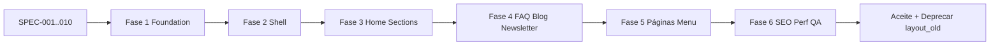

# SPEC-001 — Visão Geral da Migração

| Campo | Valor |
| --- | --- |
| ID | SPEC-001 |
| Título | Visão Geral da Migração do Site Institucional |
| Status | Draft |
| Repo | `site` |
| Fonte de referência | Auditoria `layout_old` (validada) |
| Stack alvo | Next.js 16.3 · React 19 · TypeScript |

---

## Objetivo

Definir o contrato arquitetural da migração do site institucional Akili Educ (legado PHP/Kiddino em `layout_old/`) para o App Router do Next.js no repositório `site`, preservando identidade visual e comportamento, sem conversão literal HTML→JSX, e sem contaminar o Portal do Responsável já existente.

## Contexto

### Situação atual

O repositório `site` já hospeda o **Portal do Responsável** (B2C):

- App Router com route groups `(auth)`, `(dashboard)`, `(public)`
- Design system shadcn/ui + Tailwind v4
- BFF `/api/*` → Laravel; cookies HttpOnly
- Home pública atual (`PublicHome`) é um **placeholder** Tailwind — não é o site institucional legado

O site institucional legado vive em `layout_old/` (63 views PHP), com assets em `public/assets/` (Bootstrap, FontAwesome, tema `style.css`, imagens Akili + tema Kiddino).

### Problema a resolver

- Marketing e aquisição ainda dependem do PHP legado (ou não existem no Next).
- Dois design systems precisam coexistir no mesmo deploy: **Kiddino/Bootstrap** (institucional) e **shadcn/Tailwind** (portal).
- Menu legado declara rotas sem views dedicadas (`/series`, `/preco-e-planos`, etc.).
- Bundle JS legado carrega plugins mortos (LayerSlider, Isotope, CounterUp…).

### Princípios

1. Migração arquitetural, não cópia de HTML.
2. Isolamento de CSS/JS do marketing via Route Group.
3. Server Components por padrão; Client Components só com interação.
4. Sem jQuery, sem `querySelector` imperativo, sem `href="index.html"`.
5. Conteúdo estático centralizado em `constants/`.
6. Portal do responsável **não** é reimplementado a partir do PHP.

## Escopo

### Incluído nesta migração

| Módulo | Descrição |
| --- | --- |
| Shell marketing | Header, TopBar, Nav desktop, Mobile Menu, Footer, ScrollToTop |
| Home institucional | Hero, A Plataforma, Sobre Nós, Método, FAQ, Blog preview |
| Páginas institucionais | Rotas do menu: Sobre, Séries, Blog, Preço e Planos, FAQ, Cadastro, Contato, Newsletter |
| Assets marketing | Bootstrap CSS, `style.css`, FontAwesome, imagens Akili necessárias, favicons |
| SEO / Performance | Metadata API, OG, fonts, `next/image`, Core Web Vitals |
| Constantes | Contato, redes, navegação, FAQ, copy da home (MVP) |
| Integração auth | Links Login/Cadastro apontando para rotas Next existentes (`/signin`, etc.) |

### Fora do escopo

| Item | Motivo |
| --- | --- |
| Dashboard aluno (`layout_old/dashboard/aluno`) | Produto aluno não é o portal `site` (guardian-only) |
| Dashboard responsável PHP | Já coberto por `(dashboard)` + features do portal |
| Checkout PHP / carrinho legado | Já existe `(public)/checkout` e fluxo de purchases |
| CMS dinâmico / API de conteúdo | MVP usa `constants/`; CMS é fase futura |
| Reescrita completa do tema CSS | Reutilizar `style.css` no escopo marketing |
| Microserviços / novo BFF de marketing | Conteúdo estático no MVP |
| EqualWeb (decisão pendente de produto) | Spec 006; não bloqueia shell/home |
| Admin / API Laravel | Repositórios separados |

## Dependências

| Dependência | Tipo | Notas |
| --- | --- | --- |
| Auditoria `layout_old` | Entrada | Contrato funcional/visual |
| `public/assets/*` | Asset | Já copiado; não recopiar |
| `lib/auth/public-routes.ts` | Código | Ampliar lista de paths públicos |
| `middleware.ts` | Código | Respeitar rotas marketing como públicas |
| Portal `(auth)` / `(dashboard)` | Existente | Destino de Login/Cadastre-se |
| SPECs 002–010 | Documentação | Detalham arquitetura, componentes, assets, fases |

## Decisões arquiteturais

| ID | Decisão | Rationale |
| --- | --- | --- |
| D-001 | Route Group `app/(marketing)/` isolado | Contém CSS Bootstrap/`style.css` sem poluir portal |
| D-002 | Manter portal shadcn intacto | Evita regressão em auth/dashboard |
| D-003 | Remover jQuery e plugins mortos | Performance + manutenibilidade; reescrever em React |
| D-004 | Bootstrap **CSS only** no marketing | Accordion/menu em React; sem `bootstrap.min.js` global |
| D-005 | Conteúdo MVP em `constants/` | Sem CMS; tipagem e revisão de copy centralizadas |
| D-006 | Auth legado → rotas Next | `/login` → `/signin`; recuperar senha → `/forgot-password` |
| D-007 | `layout_old/` permanece como referência | Não servir em produção; deletar só após aceite |
| D-008 | Home autenticada permanece portal | `app/page.tsx` atual: sessão → ChildrenHome; marketing em rotas públicas dedicadas **ou** home pública substituída (ver alternativas) |

### Decisão de Home pública (requer validação)

Hoje `app/page.tsx` bifurca: sem sessão → `PublicHome` (placeholder); com sessão → portal.

**Recomendação (D-008a):** substituir `PublicHome` pela Home marketing migrada (mesma URL `/`), mantendo bifuração por sessão.  
**Alternativa (D-008b):** marketing em `/home` e `/` continua placeholder/portal — rejeitada por SEO e paridade com legado.

## Alternativas consideradas

| Alternativa | Por que foi rejeitada |
| --- | --- |
| App Next separado só para marketing | Overhead de deploy/domínio/CORS; time único no `site` |
| Converter HTML monólito em um componente | Viola DRY, a11y, RSC; difícil de manter |
| Tailwind-izar 100% do tema na Fase 1 | Alto esforço; risco visual; adiar redesign |
| Manter jQuery + `main.js` via `next/script` | Conflitos de hidratação; dívida técnica |
| Migrar dashboard aluno no mesmo épico | Fora do persona guardian; escopo explode |

## Riscos

| Risco | Impacto | Mitigação |
| --- | --- | --- |
| Conflito CSS Bootstrap × Tailwind no root | Alto | CSS marketing **somente** no layout `(marketing)` |
| Middleware bloqueia rotas novas | Alto | Atualizar `PUBLIC_PATHS` / prefixes (SPEC-004) |
| Paridade visual incompleta | Médio | Checklist visual página a página; referência `layout_old` |
| Conteúdo CMS (`$cnt*`) ausente no Next | Médio | Extrair copy para `constants/home-content.ts`; validar com produto |
| Rotas de menu sem conteúdo real | Médio | Páginas mínimas reusando seções + empty/CTA (SPEC-004) |
| EqualWeb / compliance a11y | Médio | Decisão produto; WCAG própria no React |
| Bundle `style.css` pesado | Médio | Escopo por route group; limpeza futura (SPEC-007/009) |
| Time confunde portal × marketing | Baixo | Documentação + prefixes de pasta `marketing/` |

## Estratégia de implementação

1. Congelar SPECs (este pacote) com validação de produto/engenharia.
2. Implementar por fases (SPEC-010), cada uma com aceite independente.
3. Nunca misturar componentes shadcn do portal com classes `vs-*` do tema, salvo CTAs que navegam entre mundos (`Link` para `/signin`).
4. QA visual contra screenshots/`layout_old` (responsabilidade QA; engenharia entrega checklist).

## Critérios de aceite

- [ ] Documentação SPEC-001…010 publicada em `docs/specs/`
- [ ] Escopo e fora de escopo alinhados com stakeholders
- [ ] D-008 (home pública) decidida formalmente
- [ ] Lista de rotas públicas aprovada (SPEC-004)
- [ ] Matriz de plugins aprovada (SPEC-006)
- [ ] Nenhuma implementação de código nesta etapa de SPECs

## Checklist técnico

- [x] Auditoria usada como fonte única (sem reauditoria)
- [x] Coexistência portal × marketing documentada
- [x] Módulos migráveis vs não migráveis listados
- [x] Roadmap de fases referenciado (SPEC-010)
- [ ] Validação produto: copy CMS, EqualWeb, páginas stub
- [ ] Validação eng: middleware/public routes, CSS isolation

## Roadmap geral

| Fase | Nome | Entrega |
| --- | --- | --- |
| 0 | SPECs | Este pacote documental |
| 1 | Foundation | `(marketing)` layout, CSS, fonts, metadata base |
| 2 | Shell | Header, Footer, MobileMenu, constants site/nav |
| 3 | Home core | Hero, Plataforma, Sobre, Método |
| 4 | Home engagement | FAQ, Blog preview, Newsletter |
| 5 | Páginas institucionais | Rotas do menu + redirects auth |
| 6 | Hardening | SEO, performance, a11y, QA, deprecação `layout_old` |

Detalhamento: [SPEC-010-Implementation-Plan.md](./SPEC-010-Implementation-Plan.md).

## Referências

- `layout_old/` — referência visual/funcional
- `docs/architecture.md` — portal responsável
- SPEC-002 … SPEC-010 — detalhamento
