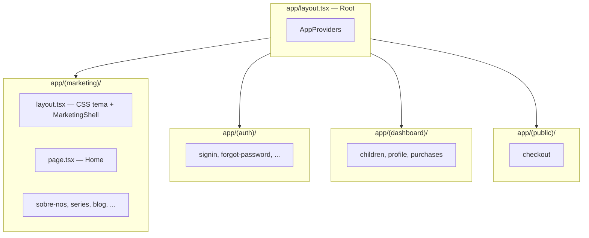
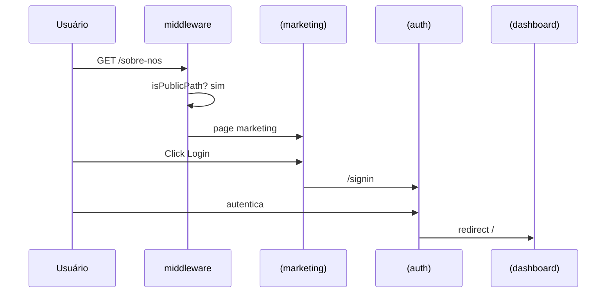
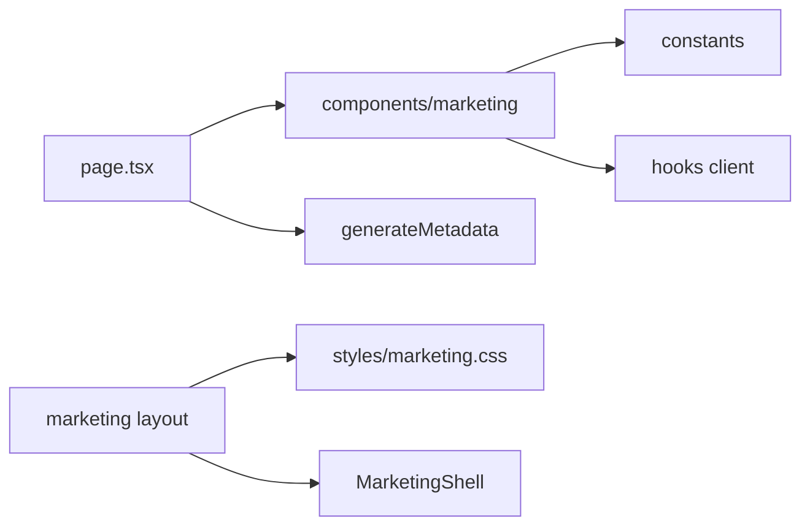

# SPEC-002 — Arquitetura Front-end

| Campo | Valor |
| --- | --- |
| ID | SPEC-002 |
| Título | Arquitetura Front-end do Site Institucional |
| Status | Draft |
| Depende de | SPEC-001 |

---

## Objetivo

Definir a arquitetura Front-end da área marketing no App Router: route groups, layouts, providers, organização de pastas, fluxo de dados e fronteiras com o Portal do Responsável.

## Contexto

O `site` já segue:

```text
app/ → components/ → features/ → services/ → lib/ → types/ → providers/ → hooks/
```

O marketing **não** introduz um segundo app; introduz um **bounded context** visual e de pastas, com CSS isolado e componentes próprios (`components/marketing/**`), evitando acoplamento ao design system shadcn do portal.

## Escopo

- App Router e Route Groups
- Layouts e Metadata
- Estrutura de pastas marketing
- Relação com middleware e public routes
- Padrões Server/Client Component
- Constants, hooks, types, services (quando aplicável)

## Fora do escopo

- Implementação de componentes (SPEC-003)
- Matriz de assets/plugins (SPEC-005/006)
- Plano de fases (SPEC-010)
- Alterações no BFF Laravel (exceto links para auth existente)

## Dependências

| Item | Uso |
| --- | --- |
| Next.js 16 App Router | Rotas e layouts |
| React 19 RSC | Server Components default |
| `middleware.ts` + `lib/auth/public-routes.ts` | Acesso público às rotas marketing |
| `public/assets` | CSS/imagens estáticas |
| SPEC-001, 003, 004, 007 | Contratos relacionados |

## Decisões arquiteturais

| ID | Decisão |
| --- | --- |
| A-001 | Route group `(marketing)` para páginas institucionais |
| A-002 | Layout marketing carrega CSS do tema; root layout permanece Tailwind/portal |
| A-003 | Componentes marketing sob `components/marketing/{layout,home,common,forms}` |
| A-004 | Feature folder opcional `features/marketing/` apenas se houver domínio (newsletter submit, blog fetch futuro) |
| A-005 | Constants em `constants/` (novo) — site, navigation, faq, home-content |
| A-006 | Páginas `app/(marketing)/**/page.tsx` são thin shells |
| A-007 | Sem Zustand/TanStack na home estática MVP |
| A-008 | `next/link`, `next/image`, `next/font`, Metadata API obrigatórios |

### App Router e Route Groups



**Nota sobre `app/page.tsx` atual:** hoje a raiz bifura sessão. Conforme D-008a (SPEC-001), a home pública marketing deve ser a experiência de `/` sem sessão. Opções de implementação:

1. **Preferida:** `app/page.tsx` continua no root; se `!session`, renderiza composição marketing (importando de `components/marketing` + CSS condicional **não desejável**).
2. **Preferida arquiteturalmente:** mover bifuração para layout/page que importa shell marketing apenas no branch público, **ou** usar `(marketing)/page.tsx` com rewrite — Route Groups não afetam URL; `(marketing)/page.tsx` e `app/page.tsx` **colidem** se ambos forem `/`.

**Contrato A-009 (Home):**

- Manter **um único** `app/page.tsx` na raiz.
- Extrair `MarketingHomePage` (composição de seções) para `components/marketing/home/MarketingHome.tsx` (ou `features/marketing/home`).
- Layout CSS do tema: aplicar via `MarketingStyles` importado **somente** quando `!session`, **ou** preferir CSS modules/scoped imports no componente marketing (SPEC-007).
- Rotas institucionais filhas vivem em `app/(marketing)/sobre-nos/page.tsx` etc. (URLs limpas).

### Layouts

| Layout | Responsabilidade |
| --- | --- |
| `app/layout.tsx` | HTML, lang, providers globais, metadata default portal |
| `app/(marketing)/layout.tsx` | Import CSS marketing, `MarketingShell` (Header+Footer+MobileMenu), body class `layout4` |
| `app/(auth)/layout.tsx` | Existente — não alterar visual nesta migração (opcional alinhamento futuro) |
| `app/(dashboard)/layout.tsx` | Existente — intocado |

### Providers

| Provider | Escopo marketing MVP |
| --- | --- |
| `AppProviders` (root) | Mantido; marketing não adiciona QueryClient usage |
| Theme provider | Marketing legado é light; não forçar dark do portal nas páginas marketing |
| Novo provider marketing | **Não** criar no MVP |

### Organização de pastas (alvo)

```text
site/
├── app/
│   ├── layout.tsx
│   ├── page.tsx                          # bifuração session | MarketingHome
│   ├── (marketing)/
│   │   ├── layout.tsx
│   │   ├── sobre-nos/page.tsx
│   │   ├── series/page.tsx
│   │   ├── blog/page.tsx
│   │   ├── preco-e-planos/page.tsx
│   │   ├── faq/page.tsx
│   │   ├── cadastro/page.tsx
│   │   ├── contato/page.tsx
│   │   └── newsletter/page.tsx
│   ├── (auth)/ …
│   ├── (dashboard)/ …
│   └── (public)/ …
├── components/
│   ├── marketing/
│   │   ├── layout/     # Header, Footer, MobileMenu, Shell, ScrollToTop, Breadcrumb
│   │   ├── home/       # Hero, AboutPlatform, AboutUs, StudyMethod, FaqSection, BlogPreview
│   │   ├── common/     # SectionTitle, Button, Logo, SocialLinks, ContactInfo
│   │   ├── forms/      # NewsletterForm (client)
│   │   └── seo/        # JsonLd helpers (opcional)
│   ├── layout/         # guardian-shell, public-home (deprecar public-home)
│   └── ui/             # shadcn — portal only
├── constants/
│   ├── site.ts
│   ├── navigation.ts
│   ├── faq.ts
│   └── home-content.ts
├── hooks/
│   ├── use-mobile-menu.ts
│   └── use-scroll-to-top.ts
├── types/
│   └── marketing.ts
├── styles/
│   └── marketing.css   # @import dos assets necessários (SPEC-007)
├── public/assets/      # existente
└── layout_old/         # referência
```

### Hooks

| Hook | Client? | Função |
| --- | --- | --- |
| `useMobileMenu` | Sim | open/close, lock scroll, Escape |
| `useScrollToTop` | Sim | visibility + smooth scroll |
| `useMediaQuery` | Sim | opcional breakpoint |

### Services

MVP estático: **sem** `services/bff` marketing.

Futuro:

| Service | Quando |
| --- | --- |
| `newsletter.bff.ts` | POST newsletter |
| `blog` queries | CMS/API posts |
| Contato form | API mailer |

### Lib

Reutilizar:

- `lib/utils.ts` (`cn`) com cuidado — classes marketing podem não ser Tailwind
- Não usar `NEXT_PUBLIC_API_URL`
- Auth links absolutos relativos: `/signin`, `/forgot-password`

### Types

```ts
// types/marketing.ts (contrato)
export type NavItem = { label: string; href: string };
export type SocialLink = { label: string; href: string; icon: "instagram" | "facebook" | "x" | "linkedin" };
export type FaqItem = { id: string; question: string; answer: React.ReactNode | string };
export type HomeHeroContent = { title: string; body: string; ctaLabel: string; ctaHref: string };
```

### Constants

| Arquivo | Conteúdo |
| --- | --- |
| `site.ts` | `MAILTO`, `TELEFONE`, redes, `siteUrl`, brand |
| `navigation.ts` | mainNav, footerNav, authLinks |
| `faq.ts` | itens accordion |
| `home-content.ts` | hero, plataforma, sobre, método |

### Fluxo de navegação



## Alternativas consideradas

| Alternativa | Decisão |
| --- | --- |
| `src/` directory | Manter raiz atual do projeto |
| Monorepo package `@akili/marketing` | Overkill para MVP |
| CSS-in-JS | Rejeitado; reutilizar CSS legado |
| Parallel routes para home | Complexidade sem ganho |

## Riscos

| Risco | Mitigação |
| --- | --- |
| Colisão `app/page.tsx` × `(marketing)/page.tsx` | A-009: home só no root; group sem `page.tsx` ou só páginas filhas |
| Import acidental de `style.css` no portal | Code review + SPEC-007 |
| Duplicação Logo/Button portal × marketing | Namespaces `marketing/` explícitos |

## Estratégia de implementação

1. Criar pastas vazias + constants tipados (Fase 1).
2. Layout `(marketing)` + styles.
3. Shell components.
4. Seções home.
5. Páginas filhas thin.
6. Atualizar `public-routes` e deprecar `PublicHome`.

## Critérios de aceite

- [ ] Estrutura de pastas documentada e seguida na implementação
- [ ] Nenhuma rota marketing exige auth
- [ ] Portal `(dashboard)` sem imports de CSS marketing
- [ ] Thin pages apenas; lógica em components/constants
- [ ] Tipagem sem `any`

## Checklist técnico

- [ ] A-009 (home) implementada sem colisão de rotas
- [ ] `(marketing)/layout.tsx` existe
- [ ] `constants/*` criados
- [ ] `components/marketing/**` criados conforme SPEC-003
- [ ] `PUBLIC_PATHS` atualizado (SPEC-004)
- [ ] `PublicHome` removido ou reduzido a reexport temporário

## Diagrama de responsabilidade


