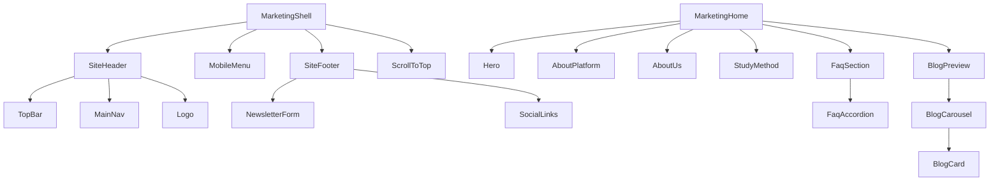

# SPEC-003 — Arquitetura de Componentes

| Campo | Valor |
| --- | --- |
| ID | SPEC-003 |
| Título | Component Architecture — Marketing |
| Status | Draft |
| Depende de | SPEC-001, SPEC-002 |

---

## Objetivo

Catalogar todos os componentes do site institucional migrado: responsabilidade, props, children, dependências, Server/Client, reutilização e relacionamentos — de forma que a implementação seja mecânica e consistente.

## Contexto

No legado, includes PHP mapeiam 1:1 para seções. Na migração, cada include vira componente React com contrato TypeScript. Componentes do portal (`components/ui`, `GuardianShell`) **não** são reutilizados para o visual Kiddino, exceto navegação cross-app via `next/link`.

## Escopo

Componentes das categorias: Layout, Home, Common, Forms, Navigation, SEO, Marketing (composições).

## Fora do escopo

- Componentes do dashboard aluno/responsável PHP
- Componentes shadcn do portal
- Implementação de código nesta etapa

## Dependências

- `constants/*`, `types/marketing.ts`
- Assets em `/assets/...`
- SPEC-004 (hrefs), SPEC-006 (comportamentos client), SPEC-007 (classes CSS)

## Decisões arquiteturais

| ID | Decisão |
| --- | --- |
| C-001 | Um componente = uma responsabilidade visual/funcional |
| C-002 | Props tipadas; sem spread de HTML solto sem necessidade |
| C-003 | Conteúdo textual via props ou constants — não hardcode espalhado |
| C-004 | Client só com estado/efeito/eventos de browser |
| C-005 | Prefixo de pasta `marketing/` evita colisão de nomes |
| C-006 | Composições (`MarketingShell`, `MarketingHome`) orquestram; não embutem markup pesado |

## Alternativas consideradas

| Alternativa | Motivo da rejeição |
| --- | --- |
| Um único `LegacyHome.tsx` com HTML colado | Viola missão; zero reuso |
| Usar shadcn Accordion no FAQ | Quebra paridade visual; opcional fase redesign |
| Web Components | Sem benefício no App Router |

## Riscos

| Risco | Mitigação |
| --- | --- |
| Props excessivas / god components | Extrair subcomponentes (ex.: `FaqItem`) |
| `"use client"` no topo da árvore | Isolar interatividade nas folhas |
| Duplicação Header desktop/mobile | `MainNav` compartilhado + `MobileMenu` consome mesmos `NavItem[]` |

---

## Catálogo de componentes

### Convenções de props

- `className?: string` opcional para extensão controlada
- Links internos: `href` string tipada a partir de `navigation.ts`
- Imagens: `src` relativo a `/assets/...` + `alt` obrigatório

---

## Layout

### `MarketingShell`

| Campo | Detalhe |
| --- | --- |
| Responsabilidade | Orquestra Header + MobileMenu + children + Footer + ScrollToTop |
| Props | `{ children: React.ReactNode }` |
| Children | Conteúdo da página |
| Dependências | `SiteHeader`, `SiteFooter`, `MobileMenu`, `ScrollToTop` |
| Server/Client | Server (filhos client isolados) |
| Reutilização | Layout `(marketing)` e branch público de `/` |
| Relacionamentos | Pai de todo conteúdo marketing |

### `SiteHeader`

| Campo | Detalhe |
| --- | --- |
| Responsabilidade | TopBar (contato/social/login) + logo + nav desktop + CTA Cadastre-se + toggle mobile |
| Props | `{ navItems?: NavItem[] }` (default `mainNav`) |
| Children | — |
| Dependências | `TopBar`, `MainNav`, `Logo`, `Button`/`Link`, constants |
| Server/Client | Server (botão mobile dispara callback via composição com `MobileMenu` client) |
| Reutilização | Todas páginas marketing |
| Relacionamentos | Legado: `headerAreaView.php` |

**Nota:** Toggle do menu mobile deve viver no Client boundary (`MobileMenuProvider` ou estado em `MobileMenu` + botão portalado). Padrão recomendado: `MobileMenu` client exporta trigger via context `MarketingChrome`.

### `TopBar`

| Campo | Detalhe |
| --- | --- |
| Responsabilidade | E-mail, telefone, redes, link Login |
| Props | — (lê `site.ts`) |
| Server/Client | Server |
| Reutilização | Header only |
| Relacionamentos | Parte de `SiteHeader` |

### `SiteFooter`

| Campo | Detalhe |
| --- | --- |
| Responsabilidade | Contato, sobre, menu footer, newsletter, copyright, social |
| Props | — |
| Children | — |
| Dependências | `Logo`, `SocialLinks`, `ContactInfo`, `NewsletterForm`, `footerNav` |
| Server/Client | Server (form client) |
| Reutilização | Shell marketing |
| Relacionamentos | `footerView.php` |

### `MobileMenu`

| Campo | Detalhe |
| --- | --- |
| Responsabilidade | Off-canvas; open/close; lista nav; fecha ao navegar |
| Props | `{ items: NavItem[]; logoSrc?: string }` |
| Children | — |
| Dependências | `useMobileMenu`, `MainNav` items, `Logo` |
| Server/Client | **Client** |
| Reutilização | Shell |
| Relacionamentos | `mobileMenuView.php` + `vsmobilemenu` |

### `ScrollToTop`

| Campo | Detalhe |
| --- | --- |
| Responsabilidade | Botão flutuante após scroll |
| Props | `{ threshold?: number }` default 500 |
| Server/Client | **Client** |
| Relacionamentos | `.scrollToTop` legado |

### `Breadcrumb`

| Campo | Detalhe |
| --- | --- |
| Responsabilidade | Trilha visual + SEO list |
| Props | `{ title: string; parent?: { label: string; href: string }; backgroundSrc?: string }` |
| Server/Client | Server |
| Reutilização | Páginas internas (não home) |
| Relacionamentos | `breadcrumbView.php` |

### `MarketingChrome` (opcional Fase 2)

| Campo | Detalhe |
| --- | --- |
| Responsabilidade | Context client para estado do menu mobile compartilhado com Header |
| Server/Client | Client provider |
| Reutilização | Envolve shell |

---

## Navigation

### `MainNav`

| Campo | Detalhe |
| --- | --- |
| Responsabilidade | Lista de links desktop ou mobile (via `variant`) |
| Props | `{ items: NavItem[]; variant: "desktop" \| "mobile"; onNavigate?: () => void }` |
| Server/Client | Server (desktop); pode ser usada dentro de client mobile |
| Reutilização | Header + MobileMenu + Footer (footer pode ter lista própria) |

### `AuthLinks`

| Campo | Detalhe |
| --- | --- |
| Responsabilidade | Login → `/signin`; Cadastre-se → rota aprovada |
| Props | `{ compact?: boolean }` |
| Server/Client | Server |

---

## Home

### `MarketingHome`

| Campo | Detalhe |
| --- | --- |
| Responsabilidade | Composição ordenada das seções da home |
| Props | — (lê constants) |
| Children | — |
| Dependências | Todas seções home |
| Server/Client | Server |
| Relacionamentos | `homeView.php` includes |

### `Hero`

| Campo | Detalhe |
| --- | --- |
| Responsabilidade | Full-bleed hero, título, texto, CTA |
| Props | `HomeHeroContent` + `backgroundSrc` |
| Server/Client | Server |
| Relacionamentos | `heroView.php` |

### `AboutPlatform`

| Campo | Detalhe |
| --- | --- |
| Responsabilidade | Seção “A Plataforma” (imagem + texto) |
| Props | `{ subtitle, title, body, image }` |
| Server/Client | Server |
| Relacionamentos | `akiliView.php` |

### `AboutUs`

| Campo | Detalhe |
| --- | --- |
| Responsabilidade | Seção Sobre Nós (texto + imagem invertida) |
| Props | Idem AboutPlatform (layout invertido via `imagePosition`) |
| Server/Client | Server |
| Relacionamentos | `sobre-nosView.php` |

### `StudyMethod`

| Campo | Detalhe |
| --- | --- |
| Responsabilidade | Método neurocientífico + etapas (conteúdo rico) |
| Props | `{ methodTitle, methodBody, stagesTitle, stagesBody }` — body pode ser structured blocks |
| Server/Client | Server |
| Relacionamentos | `metodo-de-estudosView.php` |
| Nota | Evitar `dangerouslySetInnerHTML` se possível; preferir structured content em constants |

### `FaqSection`

| Campo | Detalhe |
| --- | --- |
| Responsabilidade | Título + imagem + accordion |
| Props | `{ items: FaqItem[]; title?; subtitle?; imageSrc? }` |
| Dependências | `FaqAccordion` |
| Server/Client | Server wrapper |
| Relacionamentos | `faqView.php` |

### `FaqAccordion`

| Campo | Detalhe |
| --- | --- |
| Responsabilidade | Accordion acessível (um aberto / multi conforme legado Bootstrap) |
| Props | `{ items: FaqItem[]; defaultOpenId?: string }` |
| Server/Client | **Client** |
| Relacionamentos | Substitui `data-bs-toggle="collapse"` |

### `BlogPreview`

| Campo | Detalhe |
| --- | --- |
| Responsabilidade | Título + carousel/lista de posts + CTA “Ver mais” |
| Props | `{ posts: BlogPostCard[]; title?; subtitle? }` |
| Dependências | `BlogCard`, `BlogCarousel` |
| Server/Client | Server wrapper |
| Relacionamentos | `blogView.php` |

### `BlogCard`

| Campo | Detalhe |
| --- | --- |
| Responsabilidade | Card de post (imagem, título, excerpt, link) |
| Props | `BlogPostCard` |
| Server/Client | Server |

### `BlogCarousel`

| Campo | Detalhe |
| --- | --- |
| Responsabilidade | Carousel responsivo (substitui Slick `.vs-carousel`) |
| Props | `{ children: React.ReactNode; slidesToShow?: ResponsiveConfig }` |
| Server/Client | **Client** |
| Relacionamentos | SPEC-006 Slick |

---

## Common

### `SectionTitle`

| Campo | Detalhe |
| --- | --- |
| Responsabilidade | Decoração `title-img` + h2 + subtitle |
| Props | `{ title: string; subtitle?: string; showOrnament?: boolean; align?: "center" \| "start" }` |
| Server/Client | Server |

### `Button` (marketing)

| Campo | Detalhe |
| --- | --- |
| Responsabilidade | CTA com classes `vs-btn` variants |
| Props | `{ href?: string; type?: "button" \| "submit"; variant?: "banner" \| "v4" \| "form5" \| "default"; children; disabled? }` |
| Server/Client | Server (`Link` ou `button`) |
| Nota | **Não** confundir com `components/ui/button` |

### `Logo`

| Campo | Detalhe |
| --- | --- |
| Responsabilidade | Imagem marca + link home |
| Props | `{ variant: "positive" \| "negative"; href?: string; priority?: boolean }` |
| Server/Client | Server (`next/image`) |

### `SocialLinks`

| Campo | Detalhe |
| --- | --- |
| Responsabilidade | Lista redes com ícones FA |
| Props | `{ links?: SocialLink[]; className? }` |
| Server/Client | Server |

### `ContactInfo`

| Campo | Detalhe |
| --- | --- |
| Responsabilidade | Bloco e-mail/telefone |
| Props | `{ showLabels?: boolean }` |
| Server/Client | Server |

---

## Forms

### `NewsletterForm`

| Campo | Detalhe |
| --- | --- |
| Responsabilidade | Input e-mail + submit; feedback success/error |
| Props | `{ actionHref?: string }` |
| Server/Client | **Client** (RHF+Zod recomendado) |
| MVP | Pode `mailto:` ou POST stub; integração API futura |
| Relacionamentos | Form footer |

### `ContactForm` (página Contato)

| Campo | Detalhe |
| --- | --- |
| Responsabilidade | Formulário contato institucional |
| Props | fields tipados |
| Server/Client | **Client** |
| MVP | Página com CTA WhatsApp/e-mail se form backend não existir |

---

## SEO

### `JsonLd`

| Campo | Detalhe |
| --- | --- |
| Responsabilidade | Injeta `<script type="application/ld+json">` |
| Props | `{ data: Record<string, unknown> }` |
| Server/Client | Server |
| Relacionamentos | SPEC-008 |

### `OrganizationJsonLd` / `FAQPageJsonLd` / `BreadcrumbJsonLd`

Wrappers tipados sobre `JsonLd`.

---

## Marketing (composições de página)

| Componente | Uso |
| --- | --- |
| `MarketingHome` | `/` pública |
| `InstitutionalPage` | Template: Breadcrumb + section content |
| `FaqPage` | Reusa `FaqSection` full-width |
| `BlogIndexPage` | Lista posts (static MVP) |

---

## Mapa de relacionamentos

## Componentes legado **não** migrados (nesta fase)

| Legado | Motivo |
| --- | --- |
| `loaderView` | Preloader jQuery; LCP ruim — omitir |
| `sideMenuView` | Comentado; placeholder EN |
| `popupSearchView` | Comentado |
| `mainView`, `testimonials`, `service`, `registration`, `applyForAdmission`, `waveShape` | Inativos na home |
| Headers/menus dashboard | Fora do escopo |

## Estratégia de implementação

Ordem: Common → Layout/Navigation → Home (sem carousel) → FaqAccordion → BlogCarousel → Forms → SEO helpers.

## Critérios de aceite

- [ ] Catálogo implementado conforme tabela (sem god-file HTML)
- [ ] Client components apenas nos listados como Client
- [ ] Nenhuma prop expõe UUID/dados técnicos
- [ ] Acessibilidade básica: botões com nome, accordion teclado, foco no mobile menu
- [ ] Classes CSS do tema preservadas onde necessário à paridade

## Checklist técnico

- [ ] Props documentadas → refletidas em `types/marketing.ts`
- [ ] Imports só de `components/marketing/**` nas páginas marketing
- [ ] `PublicHome` substituído por `MarketingHome`
- [ ] Testes manuais QA: home + mobile menu + FAQ + footer newsletter
