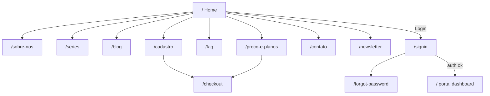

# SPEC-004 — Navegação

| Campo | Valor |
| --- | --- |
| ID | SPEC-004 |
| Título | Navegação, Rotas e Redirects |
| Status | Draft |
| Depende de | SPEC-001, SPEC-002 |

---

## Objetivo

Definir o mapa completo de navegação do site institucional (desktop, mobile, footer), rotas Next.js, redirects a partir do legado, integração com auth do portal e atualizações obrigatórias de middleware/`public-routes`.

## Contexto

O legado declara navegação em três pontos (`headerAreaView`, `mobileMenuView`, `footerView`) com inconsistências leves (footer inclui Contato/Newsletter; header não). O Next já possui rotas de auth (`/signin`, `/forgot-password`) e checkout (`/checkout`). Middleware só libera paths em `PUBLIC_PATHS`.

## Escopo

- Main nav, mobile, footer
- Breadcrumbs
- Tabela de rotas e redirects
- Atualização de rotas públicas
- Deep links Login/Cadastro/Recuperar senha

## Fora do escopo

- Navegação do dashboard portal (sidebar guardian)
- Menu aluno legado
- Search popup / sidemenu tema

## Dependências

- `constants/navigation.ts`
- `lib/auth/public-routes.ts`
- `middleware.ts`
- SPEC-003 (`MainNav`, `MobileMenu`, `Breadcrumb`)

## Decisões arquiteturais

| ID | Decisão |
| --- | --- |
| N-001 | Fonte única de verdade: `constants/navigation.ts` |
| N-002 | Header e MobileMenu consomem o **mesmo** `mainNav` |
| N-003 | Footer usa `footerNav` (superset) |
| N-004 | Login legado `/login` → redirect permanente para `/signin` |
| N-005 | Recuperar senha `/recuperar-senha` → `/forgot-password` |
| N-006 | Cadastro: `/cadastro` página marketing CTA → fluxo signup existente ou `/checkout` (validação produto) |
| N-007 | Todas rotas marketing em `PUBLIC_PATHS` ou prefixo `/` institucional |
| N-008 | Proibido `href="index.html"`; home = `/` |
| N-009 | Links externos (`target="_blank"`) com `rel="noopener noreferrer"` |

### Decisão Cadastro (pendência produto)

| Opção | Destino | Quando usar |
| --- | --- | --- |
| A | `/checkout` | Cadastro = contratar plano |
| B | `/signin` + âncora signup | Se existir signup B2C |
| C | Página `/cadastro` com formulário próprio | Se produto exigir landing de cadastro |

**Recomendação:** Opção A no MVP (CTA alinhado ao portal), mantendo rota `/cadastro` como landing curta que redireciona ou embute CTA para `/checkout`.

## Alternativas consideradas

| Alternativa | Decisão |
| --- | --- |
| Subdomínio marketing | Rejeitado (SPEC-001) |
| Hash routes `#faq` only | Complementar OK; não substitui `/faq` |
| i18n rotas | Fora de escopo |

## Riscos

| Risco | Mitigação |
| --- | --- |
| Middleware 302 para `/signin` em páginas novas | Atualizar `PUBLIC_PATHS` na mesma PR da rota |
| SEO soft-404 em stubs | Conteúdo mínimo + `noindex` temporário se necessário |
| Inconsistência header/footer | Documentar diferenças intencionais |

---

## Menu desktop (`mainNav`)

| Label | Href | Ativo no legado |
| --- | --- | --- |
| Home | `/` | Sim |
| Sobre Nós | `/sobre-nos` | Link sim / página não |
| Séries | `/series` | Link sim / página não |
| Blog | `/blog` | Link sim / página não |
| Preço e Planos | `/preco-e-planos` | Link sim / página não |
| FAQ | `/faq` | Link sim / seção na home |

CTA header: **CADASTRE-SE** → conforme N-006.  
TopBar: **LOGIN** → `/signin`.

## Menu mobile

Mesmos itens de `mainNav`. Comportamento:

- Toggle `.vs-menu-toggle` → estado React
- Overlay fecha ao clicar fora / Escape / navegação
- Sem submenu no legado atual (flat list)

## Footer (`footerNav`)

| Label | Href |
| --- | --- |
| Home | `/` (não `/home`) |
| Sobre Nós | `/sobre-nos` |
| Séries | `/series` |
| Blog | `/blog` |
| Preços e Planos | `/preco-e-planos` |
| FAQ | `/faq` |
| Cadastre-se | `/cadastro` |
| Contato | `/contato` |
| Newsletter | `/newsletter` |

**Correção consciente:** legado usa `WWW."home"`; Next usa `/`.

## Breadcrumbs

Usar em páginas internas (não na home):

```text
Home > {Título da página}
```

Props conforme SPEC-003. JSON-LD BreadcrumbList em SPEC-008.

## Rotas Next.js

| Rota | Arquivo | Conteúdo MVP |
| --- | --- | --- |
| `/` | `app/page.tsx` (branch público) | `MarketingHome` |
| `/sobre-nos` | `(marketing)/sobre-nos/page.tsx` | AboutUs + opcional Platform |
| `/series` | `(marketing)/series/page.tsx` | Stub editorial / CTA |
| `/blog` | `(marketing)/blog/page.tsx` | Lista posts constants |
| `/preco-e-planos` | `(marketing)/preco-e-planos/page.tsx` | Planos + CTA checkout |
| `/faq` | `(marketing)/faq/page.tsx` | FaqSection full |
| `/cadastro` | `(marketing)/cadastro/page.tsx` | Landing + CTA |
| `/contato` | `(marketing)/contato/page.tsx` | Contato + mailto/tel |
| `/newsletter` | `(marketing)/newsletter/page.tsx` | Form destaque |

### Rotas auth (existentes — não recriar)

| Rota | Uso marketing |
| --- | --- |
| `/signin` | Login |
| `/forgot-password` | Recuperar senha |
| `/checkout` | Conversão / cadastro plano |
| `/first-access`, `/invite` | Fora do menu marketing |

## Redirects (legado → Next)

| Origem | Destino | Tipo |
| --- | --- | --- |
| `/login` | `/signin` | 308 |
| `/recuperar-senha` | `/forgot-password` | 308 |
| `/home` | `/` | 308 |
| `/blogs` | `/blog` | 308 |
| `/index.html` | `/` | 308 |

Implementação: `next.config.ts` `redirects()` ou Route Handlers — preferir `redirects()` estático.

## Public routes — alteração obrigatória

Ampliar `lib/auth/public-routes.ts`:

```ts
const PUBLIC_PATHS = [
  "/",
  "/checkout",
  "/signin",
  "/forgot-password",
  "/first-access",
  "/invite",
  // marketing
  "/sobre-nos",
  "/series",
  "/blog",
  "/preco-e-planos",
  "/faq",
  "/cadastro",
  "/contato",
  "/newsletter",
] as const;
```

Alternativa mais segura: `PUBLIC_PREFIXES` marketing ou helper `isMarketingPath`. Preferir lista explícita no MVP (auditoria de superfície).

## Mapa de navegação



## Navegação futura

| Item | Descrição |
| --- | --- |
| Blog dinâmico | `/blog/[slug]` |
| Séries detalhe | `/series/[slug]` |
| Âncoras home | `/#metodo`, `/#faq` além das páginas |
| Locale | `/pt/...` se i18n |
| Área aluno | App separado ou route group futuro |

## Estratégia de implementação

1. Criar `constants/navigation.ts`.
2. Atualizar `PUBLIC_PATHS` + redirects no `next.config`.
3. Implementar `MainNav` / menus.
4. Criar páginas stub com Breadcrumb + conteúdo mínimo.
5. Substituir CTAs auth.

## Critérios de aceite

- [ ] Todos links header/mobile/footer resolvem sem 404
- [ ] Usuário deslogado acessa todas rotas marketing sem redirect login
- [ ] `/login` e `/home` redirecionam corretamente
- [ ] Login e Cadastre-se levam ao fluxo Next correto
- [ ] Nenhum `index.html` no código novo

## Checklist técnico

- [ ] `navigation.ts` exporta `mainNav`, `footerNav`, `authLinks`
- [ ] `public-routes.ts` atualizado
- [ ] `next.config.ts` redirects
- [ ] Smoke manual mobile + desktop
- [ ] Validação produto: destino Cadastre-se (A/B/C)
