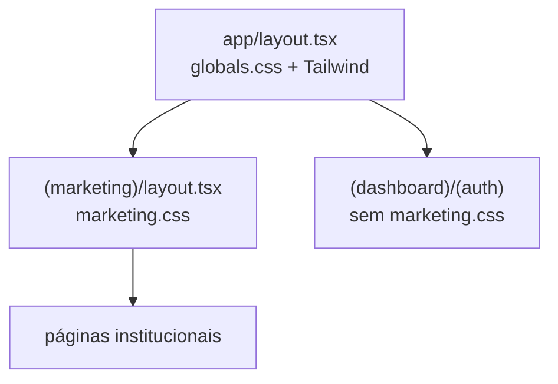

# SPEC-007 — Estratégia CSS

> **Status documental:** **Historical (parcial)** — **Superseded by [ADR-018](../adr/ADR-018-Marketing-Architecture-Reconciliation.md)** nos itens CSS-002, CSS-003 e CSS-008 (dual-DS / isolamento por route group / Preflight portal).  
> Mantidos: CSS-001, CSS-004 (consolidada em `KiddinoRoot`), CSS-005…007.  
> Estratégia vigente: [SPEC-019 § CSS](./SPEC-019-Architectural-Contract.md).

| Campo | Valor |
| --- | --- |
| ID | SPEC-007 |
| Título | Estratégia CSS — Marketing × Portal |
| Status | **Historical** (parcialmente superseded) |
| Depende de | SPEC-001, SPEC-002, SPEC-005 |

---

## Objetivo

Definir como o CSS do tema institucional (Bootstrap + `style.css` + FontAwesome) coexiste com Tailwind v4 / shadcn do Portal do Responsável, sem regressões visuais cruzadas, com ordem de carregamento clara e caminho de evolução.

## Contexto

- Portal: `app/globals.css` + Tailwind v4 + tokens em `styles/tokens.css`.
- Marketing legado: Bootstrap grid + tema monolítico `style.css` (classes `vs-*`, `layout4`, `container-style4`).
- Mesmo `app/layout.tsx` envolve ambos os mundos.

Conflitos potenciais: reset/reboot Bootstrap vs Preflight Tailwind; `container`; tipografia global; `button`/`a` styles.

## Escopo

- Escopo por Route Group / imports
- Ordem de cascata
- Isolamento portal × marketing
- Organização futura (modules, limpeza)

## Fora do escopo

- Redesign visual Tailwind-first
- Purge automático completo do `style.css` na Fase 1
- Dark mode no marketing

## Dependências

- `public/assets/css/*`
- `styles/marketing.css` (a criar na implementação)
- Layout `(marketing)` e branch home pública

## Decisões arquiteturais

| ID | Decisão |
| --- | --- |
| CSS-001 | CSS do tema **não** entra em `globals.css` globalmente | **Mantida** |
| CSS-002 | Entry único `styles/marketing.css` com `@import` dos assets aprovados | **Substituída** — `<link>` via `KiddinoThemeStyles` (ADR-018) |
| CSS-003 | Import de `marketing.css` **somente** em `app/(marketing)/layout.tsx` … | **Substituída** — tema no root via `KiddinoRoot` |
| CSS-004 | Body class `layout4` aplicada no layout marketing | **Consolidada** — `KiddinoRoot` no body |
| CSS-005 | Não usar CSS Modules para reescrever o tema inteiro no MVP | **Mantida** |
| CSS-006 | Preferir classes existentes do tema nos componentes marketing | **Mantida** (agora também portal) |
| CSS-007 | Overrides pontuais em `styles/marketing-overrides.css` (após tema) | **Mantida** (`styles/marketing.css`) |
| CSS-008 | Portal continua Preflight Tailwind… | **Obsoleta** — Tailwind/shadcn removidos do `site` |

### Tensão root layout × marketing

O root já importa `globals.css` (Tailwind). Páginas marketing herdarão Preflight **e** Bootstrap.

| Problema | Mitigação |
| --- | --- |
| Preflight × Reboot | Overrides em `marketing-overrides.css` restaurando tipografia/tema nas páginas marketing (wrapper `.marketing-root`) |
| `container` width | Preferir classes do tema `container-style4` no markup marketing |
| Botões shadcn vs `vs-btn` | Nunca misturar; CTAs marketing só `vs-btn` |
| Font Geist no root | Layout marketing reaplica Fredoka/Jost via `next/font` className no `.marketing-root` |

**Padrão obrigatório:**

```html
<div class="marketing-root layout4">…</div>
```

Todos os estilos de correção com escopo `.marketing-root …`.

## Alternativas consideradas

| Alternativa | Decisão |
| --- | --- |
| iframe marketing | Isolamento total; SEO/UX ruins — rejeitado |
| Shadow DOM | Complexo demais |
| Desligar Preflight no root | Quebra portal — rejeitado |
| Tailwind-izar tema na Fase 1 | Fora do prazo — rejeitado |
| `styled-jsx` | Desnecessário |

## Riscos

| Risco | Impacto | Mitigação |
| --- | --- | --- |
| Regressão visual portal | Alto | Nunca importar `style.css` fora do marketing |
| Hero/header “quebrados” por Preflight | Alto | Overrides + QA visual |
| Duplicação CSS grande | Médio | Aceito MVP; SPEC-009 |
| FOUC fonts | Médio | `next/font` + display swap |

---

## Bootstrap

| Aspecto | Política |
| --- | --- |
| Versão | A do arquivo `bootstrap.min.css` em assets (não npm no MVP) |
| JS | Não |
| Utilitários | Permitidos no JSX marketing (`row`, `col-lg-6`, `d-none`, `d-lg-block`) |
| Accordion | Classes visuais + React state |

## CSS legado (`style.css`)

| Aspecto | Política |
| --- | --- |
| Fonte | `/assets/css/style.css` via import |
| Edição in-place | Evitar; usar overrides |
| Dependência de jQuery classes | Garantir que React adiciona mesmas classes (`vs-body-visible`, `show`, etc.) |

## Escopo do Route Group



Home `/` (root page): deve renderizar dentro de `MarketingRoot` que importa os mesmos estilos (ou reutilizar layout pattern) para não divergir das páginas `(marketing)/*`.

**Recomendação de implementação:** extrair `MarketingProviders`/`MarketingRoot` usado por `(marketing)/layout.tsx` **e** pelo branch público de `app/page.tsx`.

## Ordem de carregamento

Dentro de `styles/marketing.css`:

1. `bootstrap.min.css`
2. `fontawesome.min.css`
3. `style.css`
4. `marketing-overrides.css` (local)
5. Variáveis de fonte (`--font-fredoka`, etc.)

**Não** importar: slick, magnific, layerslider.

## Conflitos com Portal — matriz

| Seletor / área | Portal | Marketing | Regra |
| --- | --- | --- | --- |
| `body` font | Geist/Tailwind | Fredoka/Jost via `.marketing-root` | Escopo |
| `a` color | tokens | tema `style.css` | Escopo |
| `button` | shadcn | `vs-btn` | Não misturar |
| Spacing utilities | Tailwind | Bootstrap | Prefixo contexto |
| Z-index menu | portal chrome | `vs-menu-wrapper` | QA mobile |

## CSS Global vs Modules

| Tipo | Uso MVP |
| --- | --- |
| Global marketing entry | Sim — `marketing.css` |
| CSS Modules | Apenas overrides pontuais novos se necessário (`Hero.module.css`) |
| Tailwind classes em marketing | **Evitar** no MVP (exceto wrappers invisíveis) |
| Inline style | Evitar; exceção background dinâmico documentada |

## Organização futura

```text
styles/
  tokens.css              # portal
  marketing.css           # entry @imports
  marketing-overrides.css # correções Preflight/tema
  marketing/
    _carousel.css         # se carousel CSS-only
```

Fases posteriores:

1. Extrair critical CSS home.
2. Remover dead selectors do tema (ferramenta).
3. Migrar gradualmente seções para Tailwind + design tokens Akili.

## Estratégia de implementação

1. Criar `styles/marketing.css` + overrides mínimos.
2. `MarketingRoot` + fonts.
3. QA side-by-side com `layout_old` screenshots.
4. Corrigir conflitos só via overrides escopados.

## Critérios de aceite

- [ ] Navegação no portal autenticado sem regressão visual Tailwind
- [ ] Home marketing com layout comparável ao legado (desktop + mobile)
- [ ] Network: sem CSS slick/layerslider/magnific
- [ ] `.marketing-root` presente em todas páginas institucionais
- [ ] Nenhum edit destrutivo em `public/assets/css/style.css` sem registro

## Checklist técnico

- [ ] Import path correto (`@/styles/marketing.css`)
- [ ] FontAwesome ícones visíveis
- [ ] Grid Bootstrap colunas home OK
- [ ] Menu mobile overlay z-index acima do header
- [ ] Documentar overrides aplicados
