# SPEC-010 — Plano de Implementação

| Campo | Valor |
| --- | --- |
| ID | SPEC-010 |
| Título | Plano de Implementação da Migração Marketing |
| Status | Draft |
| Depende de | SPEC-001 … SPEC-009 |

---

## Objetivo

Definir o plano executável da migração do site institucional em fases incrementais, cada uma com objetivo, arquivos, dependências, aceite, riscos e esforço — permitindo entregar valor sem big-bang.

## Contexto

SPECs 001–009 formam o contrato. Este plano traduz o contrato em sprints de engenharia no repo `site`. QA valida visualmente contra `layout_old`. Testes automatizados **não** são criados pela engenharia salvo pedido explícito (regra do monorepo).

## Escopo

Fases 1–6 da migração marketing + gates de validação pré-código.

## Fora do escopo

- Dashboard aluno/responsável PHP
- Redesign Tailwind completo
- CMS dinâmico
- Implementação nesta etapa documental

## Dependências

| Gate pré-implementação | Owner |
| --- | --- |
| Aprovar D-008 home pública | Eng + Produto |
| Destino CTA Cadastre-se (N-006) | Produto |
| Copy meta SEO + home-content | Produto/Marketing |
| EqualWeb sim/não | Produto/Jurídico |
| Valores reais MAILTO/TELEFONE/redes | Produto |

## Decisões arquiteturais

| ID | Decisão |
| --- | --- |
| IMP-001 | Entrega vertical por fase com merge em main via PR |
| IMP-002 | Cada fase deve manter portal existente verde (smoke manual auth) |
| IMP-003 | Não iniciar Fase N+1 com aceite da Fase N aberto em P0 |
| IMP-004 | Estimativas em **pontos relativos** (1 = ~meio dia eng senior focado) |

## Alternativas consideradas

| Alternativa | Decisão |
| --- | --- |
| Big-bang PR única | Rejeitado — review impossível |
| Feature flag por seção | Opcional; default branch por fases |
| Migrar páginas menu antes da home | Rejeitado — home é referência visual |

## Riscos (plano)

| Risco | Fase | Mitigação |
| --- | --- | --- |
| Gates produto atrasam | 0→1 | Usar placeholders tipados em constants |
| Conflito CSS | 1–3 | SPEC-007 overrides |
| Escopo creep dashboard | todas | Recusar; apontar SPEC-001 fora de escopo |

## Estratégia de implementação

```mermaid
gantt
  title Migração Marketing Akili
  dateFormat  X
  axisFormat %s
  section Foundation
  Fase1 Layout CSS Fonts     :a1, 0, 3
  section Shell
  Fase2 Header Footer Menu   :a2, 3, 5
  section Home
  Fase3 Secoes Core          :a3, 5, 9
  Fase4 FAQ Blog Newsletter  :a4, 9, 12
  section Pages
  Fase5 Rotas institucionais :a5, 12, 16
  section Hardening
  Fase6 SEO Perf QA          :a6, 16, 20
```



---

## Fase 0 — Validação das SPECs (pré-código)

### Objetivo

Congelar contrato e pendências bloqueantes.

### Arquivos envolvidos

- `docs/specs/SPEC-001` … `SPEC-010` (este pacote)

### Dependências

Auditoria validada.

### Critérios de aceite

- [ ] Stakeholders revisaram SPEC-001/004/006/008
- [ ] Pendências listadas abaixo resolvidas ou explicitamente adiadas com owner

### Riscos

Documentação divergir do produto — review conjunto.

### Estimativa

1–2 pontos (reuniões + ajustes docs).

---

## Fase 1 — Foundation (Route Group, Layout, Bootstrap, Fonts, Metadata)

### Objetivo

Criar a fundação técnica do marketing sem seções de conteúdo ainda (página placeholder institucional OK).

### Arquivos envolvidos

```text
app/(marketing)/layout.tsx
styles/marketing.css
styles/marketing-overrides.css
constants/site.ts
constants/navigation.ts
types/marketing.ts
components/marketing/layout/MarketingRoot.tsx (ou equivalente)
lib/auth/public-routes.ts          # atualizar
next.config.ts                     # redirects iniciais
app/layout.tsx                     # apenas se metadata template exigir cuidado
```

### Dependências

Gates: `SITE_URL`, contatos mínimos em `site.ts`.

### Critérios de aceite

- [ ] Rota `/sobre-nos` (stub) pública renderiza sem auth redirect
- [ ] CSS bootstrap + style + FA aplicados só no marketing root
- [ ] Fonts Fredoka/Jost via `next/font` (sem fonts.googleapis.com)
- [ ] Metadata base marketing sem texto Kiddino
- [ ] Portal `/signin` visualmente intacto (smoke)

### Riscos

Preflight vs Bootstrap — mitigar overrides.

### Estimativa

3–5 pontos.

---

## Fase 2 — Shell (Header, Footer, Mobile Menu)

### Objetivo

Paridade de chrome com `headerAreaView`, `mobileMenuView`, `footerView`.

### Arquivos envolvidos

```text
components/marketing/layout/*
components/marketing/common/{Logo,SocialLinks,ContactInfo,Button}
components/marketing/forms/NewsletterForm.tsx
hooks/use-mobile-menu.ts
hooks/use-scroll-to-top.ts
constants/navigation.ts
```

### Dependências

Fase 1.

### Critérios de aceite

- [ ] TopBar: e-mail, telefone, social, Login → `/signin`
- [ ] Nav desktop = `mainNav`
- [ ] CTA Cadastre-se conforme N-006
- [ ] Mobile menu open/close/Escape/overlay
- [ ] Footer: sobre, menu, newsletter UI, copyright, social
- [ ] ScrollToTop funcional
- [ ] Zero `index.html`

### Riscos

Z-index menu; estado client no header.

### Estimativa

5–8 pontos.

---

## Fase 3 — Home Core (Hero, Plataforma, Sobre, Método)

### Objetivo

Substituir `PublicHome` pela composição visual principal da home.

### Arquivos envolvidos

```text
components/marketing/home/{MarketingHome,Hero,AboutPlatform,AboutUs,StudyMethod}
components/marketing/common/SectionTitle.tsx
constants/home-content.ts
app/page.tsx                       # branch !session → MarketingHome + MarketingRoot
```

### Dependências

Fase 2; copy `home-content` (placeholders OK se marcados TODO produto).

### Critérios de aceite

- [ ] `/` deslogado mostra Hero → Plataforma → Sobre → Método
- [ ] `/` logado continua portal (ChildrenHome)
- [ ] Imagens `next/image`; hero LCP priority
- [ ] Paridade layout desktop/mobile razoável vs legado
- [ ] CTAs apontam rotas Next corretas

### Riscos

Conteúdo CMS HTML rico no método — structured constants.

### Estimativa

5–8 pontos.

---

## Fase 4 — FAQ, Blog, Newsletter

### Objetivo

Completar seções de engagement da home + comportamento client.

### Arquivos envolvidos

```text
components/marketing/home/{FaqSection,FaqAccordion,BlogPreview,BlogCard,BlogCarousel}
constants/faq.ts
constants/blog.ts                  # posts MVP estáticos
components/marketing/forms/NewsletterForm.tsx (integração)
```

### Dependências

Fase 3; decisão carousel (CSS vs Embla) SPEC-006.

### Critérios de aceite

- [ ] Accordion FAQ teclado + ARIA; um item aberto default
- [ ] Blog preview responsivo (breakpoints 3/2/1)
- [ ] CTA “Ver mais” → `/blog`
- [ ] Newsletter: validação e-mail + feedback (stub API OK)
- [ ] Sem Slick/jQuery na rede

### Riscos

A11y accordion; performance carousel.

### Estimativa

5–7 pontos.

---

## Fase 5 — Páginas Institucionais + Redirects Auth

### Objetivo

Materializar rotas do menu e redirects do legado.

### Arquivos envolvidos

```text
app/(marketing)/sobre-nos/page.tsx
app/(marketing)/series/page.tsx
app/(marketing)/blog/page.tsx
app/(marketing)/preco-e-planos/page.tsx
app/(marketing)/faq/page.tsx
app/(marketing)/cadastro/page.tsx
app/(marketing)/contato/page.tsx
app/(marketing)/newsletter/page.tsx
components/marketing/layout/Breadcrumb.tsx
next.config.ts                     # redirects completos
lib/auth/public-routes.ts          # lista final
```

### Dependências

Fases 2–4 (reuso de seções).

### Critérios de aceite

- [ ] Todos links header/footer/mobile resolvem
- [ ] Redirects `/login`, `/home`, `/recuperar-senha`, `/blogs` OK
- [ ] Breadcrumb nas internas
- [ ] Páginas stub não autenticadas
- [ ] Metadata por página (mínimo title/description)

### Riscos

Thin content SEO — alinhar SEO-007.

### Estimativa

5–8 pontos.

---

## Fase 6 — SEO, Performance, QA, Deploy

### Objetivo

Hardening para go-live marketing.

### Arquivos envolvidos

```text
app/sitemap.ts
app/robots.ts
components/marketing/seo/*
ajustes overrides CSS
remoção/deprecação PublicHome
docs: notas de release
```

### Dependências

Fases 1–5; decisão EqualWeb; copy meta final.

### Critérios de aceite

- [ ] Sitemap/robots ativos
- [ ] JSON-LD Organization + FAQPage
- [ ] Lighthouse staging registrado (Performance/SEO)
- [ ] Sem requests a plugins mortos / Google Fonts CSS
- [ ] Checklist visual QA assinado
- [ ] `layout_old` marcado deprecated (ainda no repo até aceite final produto)
- [ ] Smoke portal auth + checkout

### Riscos

Descobertas visuais tardias — buffer.

### Estimativa

4–6 pontos.

---

## Resumo de esforço

| Fase | Estimativa (pontos) |
| --- | --- |
| 0 | 1–2 |
| 1 | 3–5 |
| 2 | 5–8 |
| 3 | 5–8 |
| 4 | 5–7 |
| 5 | 5–8 |
| 6 | 4–6 |
| **Total** | **≈ 28–44 pontos** |

(Calibrar com velocity do time; não é compromisso de calendário.)

## Critérios de aceite (épico completo)

- [ ] Site institucional no Next com paridade visual aceita
- [ ] Portal responsável sem regressão
- [ ] SPECs respeitadas (sem jQuery, sem HTML monólito)
- [ ] Rotas públicas e SEO básicos
- [ ] Pendências EqualWeb/CMS registradas como follow-ups

## Checklist técnico (épico)

- [ ] Todas fases com PR + review
- [ ] `PUBLIC_PATHS` completo
- [ ] Constants sem secrets
- [ ] A11y básica (menu, FAQ, contraste logos)
- [ ] Documentação `docs/architecture.md` atualizada com nota marketing (follow-up doc, pós-código)

## Ordem sugerida de PRs

1. `feat(marketing): foundation layout + public routes`
2. `feat(marketing): shell header footer mobile`
3. `feat(marketing): home core sections`
4. `feat(marketing): faq blog newsletter`
5. `feat(marketing): institutional pages + redirects`
6. `feat(marketing): seo performance hardening`

## Critérios de aceite deste documento

- [ ] Fases 1–6 cobrem o roadmap SPEC-001
- [ ] Cada fase tem objetivo, arquivos, deps, aceite, riscos, esforço
- [ ] Pendências de validação explícitas

## Checklist técnico deste documento

- [x] Alinhado SPEC-001…009
- [x] Sem instruções de implementar código nesta etapa
- [ ] Review eng + produto
