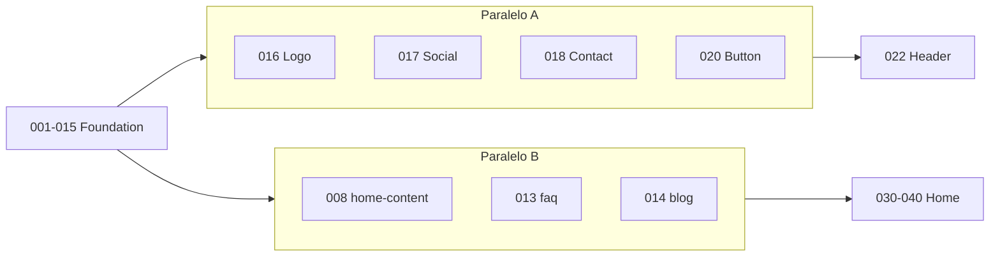

# SPEC-011 — Backlog Técnico de Implementação

> **Continuidade (ADR-018):** este backlog permanece a fonte das tarefas **MARKETING-***. Não restaurar dual-DS / isolamento shadcn. Contrato vigente: [ADR-018](../adr/ADR-018-Marketing-Architecture-Reconciliation.md) + [SPEC-019](./SPEC-019-Architectural-Contract.md).

| Campo | Valor |
| --- | --- |
| ID | SPEC-011 |
| Título | Backlog Técnico de Implementação — Site Institucional |
| Status | Executado (MVP) — ver SPEC-012 · continuidade sob ADR-018 |
| Depende de | SPEC-001 … SPEC-010 (aprovadas; trechos dual-DS Historical) |
| Repo | `site` |
| Status detalhado | [SPEC-012-Implementation-Status.md](./SPEC-012-Implementation-Status.md) |

---

## Objetivo

Transformar a arquitetura aprovada (SPEC-001–010) em um backlog técnico executável, com tarefas pequenas, independentes quando possível, e critérios objetivos — permitindo implementar **uma tarefa por vez**, com baixo risco e alta previsibilidade.

> **Atualização (2026-08-05):** MARKETING-001…060 implementados no repo `site`. Pendência formal: MARKETING-061 (Lighthouse). Detalhes em SPEC-012.

> **Contexto pós-reconciliação:** a frase “Portal do Responsável permanece intocado” abaixo é **Historical** — o portal passou a Kiddino (SPEC-013 / ADR-018). O backlog MARKETING-* ainda vale para o institucional; checklists do tipo “sem misturar shadcn” permanecem válidos no sentido de não reintroduzir shadcn nas páginas marketing.

## Contexto

- Fonte de verdade visual/funcional: `layout_old/`
- Assets: `public/assets/` (já presentes)
- ~~Portal do Responsável permanece intocado~~ → **Replaced by ADR-018:** portal visual Kiddino; integração via home D-008a, redirects e middleware
- **Nenhum código é implementado neste documento** — somente tarefas

## Escopo

Backlog dos épicos: Foundation, Layout, Home, Páginas, SEO, Performance.

## Fora do escopo

- Dashboard aluno/responsável PHP
- CMS dinâmico
- EqualWeb (tarefa opcional gated — ver backlog futuro)
- Testes automatizados (salvo pedido explícito)
- Implementação de código nesta SPEC

## Convenções do backlog

| Campo | Valores |
| --- | --- |
| ID | `MARKETING-NNN` sequencial |
| Complexidade | XS · S · M · L · XL |
| Estimativa | Horas eng. (foco); 1 ponto SPEC-010 ≈ 4h |
| Prioridade | P0 (bloqueante) · P1 · P2 · P3 |
| Paths | Relativos à raiz do repo `site/` |
| Componentes | Sob `components/marketing/**` (SPEC-002/003) |

### Definition of Done (global — aplica a toda tarefa)

Além do DoD específico da tarefa:

1. TypeScript estrito, **sem `any`**
2. **Sem jQuery**, sem `document.querySelector` imperativo, sem `onclick` inline
3. Server Component por padrão; `"use client"` só se justificado
4. Sem warnings novos de ESLint/TypeScript na área tocada
5. Links via `next/link`; imagens via `next/image` quando aplicável
6. Sem exposição de UUID/IDs técnicos na UI
7. Critérios de aceite da tarefa marcados
8. Smoke: portal `/signin` ainda acessível (quando a mudança toca middleware/layout root)

### Critérios transversais (repetir mentalmente)

Responsivo · Tipado · Componentizado · Sem jQuery · Sem `any` · Acessível (teclado/ARIA básico)

---

## Mapa de épicos

| Épico | IDs | Objetivo |
| --- | --- | --- |
| 1 — Foundation | MARKETING-001 … 015 | Base técnica, CSS, constants, rotas públicas |
| 2 — Layout | MARKETING-016 … 029 | Shell visual (header/footer/menu) |
| 3 — Home | MARKETING-030 … 042 | Seções da home + composição |
| 4 — Páginas | MARKETING-043 … 050 | Rotas institucionais do menu |
| 5 — SEO | MARKETING-051 … 056 | Metadata, sitemap, schema |
| 6 — Performance | MARKETING-057 … 061 | Imagens, fonts, lazy, Lighthouse |

**Total:** 61 tarefas · **Estimativa agregada:** ~118–152h (calibrar com o time)

---

# Épico 1 — Foundation

---

### MARKETING-001 — Criar Route Group `(marketing)`

| Campo | Valor |
| --- | --- |
| Complexidade | XS |
| Estimativa | 1h |
| Prioridade | P0 |

**Descrição:** Criar o route group App Router para páginas institucionais, sem colidir com `app/page.tsx` (home permanece na raiz — A-009).

**Contexto:** SPEC-002. O group não deve declarar `page.tsx` em `/` para evitar conflito com a home bifucada.

**Arquivos novos:**
- `app/(marketing)/.gitkeep` (ou primeira página stub na 043+)

**Arquivos alterados:**
- (nenhum obrigatório além da pasta)

**Depende de:** —

**Critérios de aceite:**
- [ ] Pasta `app/(marketing)/` existe
- [ ] Nenhuma colisão de rota `/` com `app/page.tsx`
- [ ] Build/typecheck não quebra

**Checklist técnico:**
- [ ] Segue App Router conventions
- [ ] Documentado no PR que home não vive neste group

**DoD:** Route group criado e validado sem regressão de rotas existentes.

---

### MARKETING-002 — Criar `MarketingRoot` + Layout marketing

| Campo | Valor |
| --- | --- |
| Complexidade | S |
| Estimativa | 2h |
| Prioridade | P0 |

**Descrição:** Implementar wrapper `.marketing-root.layout4` e `app/(marketing)/layout.tsx` que o utiliza (shell mínimo: children only até Épico 2).

**Contexto:** SPEC-002 A-009, SPEC-007 CSS-004.

**Arquivos novos:**
- `components/marketing/layout/MarketingRoot.tsx`
- `app/(marketing)/layout.tsx`

**Arquivos alterados:**
- —

**Depende de:** MARKETING-001, MARKETING-003 (CSS pode ser PR conjunta)

**Critérios de aceite:**
- [ ] Layout marketing envolve children com `MarketingRoot`
- [ ] Classes `marketing-root layout4` presentes no DOM
- [ ] Server Component

**Checklist técnico:**
- [ ] Tipado
- [ ] Sem CSS portal importado aqui além do entry marketing

**DoD:** Layout renderiza stub child sem erro.

---

### MARKETING-003 — Criar `styles/marketing.css`

| Campo | Valor |
| --- | --- |
| Complexidade | S |
| Estimativa | 1.5h |
| Prioridade | P0 |

**Descrição:** Entry CSS do marketing com `@import` apenas dos assets aprovados (Bootstrap, FontAwesome, style) — sem slick/layerslider/magnific.

**Contexto:** SPEC-005, SPEC-007.

**Arquivos novos:**
- `styles/marketing.css`
- `styles/marketing-overrides.css` (stub vazio ou mínimo)

**Arquivos alterados:**
- `app/(marketing)/layout.tsx` (import)

**Depende de:** MARKETING-001

**Critérios de aceite:**
- [ ] Imports ⊆ lista aprovada SPEC-005
- [ ] Não importa CSS de plugins mortos
- [ ] Não adicionado a `app/globals.css`

**Checklist técnico:**
- [ ] Paths `/assets/css/...` resolvem
- [ ] Portal não carrega `marketing.css` nas rotas dashboard

**DoD:** CSS marketing carregado só no layout marketing.

---

### MARKETING-004 — Configurar Bootstrap (CSS only)

| Campo | Valor |
| --- | --- |
| Complexidade | XS |
| Estimativa | 1h |
| Prioridade | P0 |

**Descrição:** Garantir Bootstrap CSS via entry marketing; **não** carregar `bootstrap.min.js`. Validar grid básico com markup de teste temporário ou página stub.

**Contexto:** SPEC-006, SPEC-007.

**Arquivos novos:** —
**Arquivos alterados:**
- `styles/marketing.css`
- `styles/marketing-overrides.css` (correções Preflight se necessário)

**Depende de:** MARKETING-003

**Critérios de aceite:**
- [ ] Classes `container` / `row` / `col-*` funcionam no marketing
- [ ] Zero `bootstrap.min.js` no Network
- [ ] Sem jQuery

**Checklist técnico:**
- [ ] Overrides escopados em `.marketing-root`

**DoD:** Grid Bootstrap utilizável sem JS Bootstrap.

---

### MARKETING-005 — Configurar Fonts (`next/font`)

| Campo | Valor |
| --- | --- |
| Complexidade | S |
| Estimativa | 2h |
| Prioridade | P0 |

**Descrição:** Configurar Fredoka + Jost via `next/font/google`, variáveis CSS, aplicar em `MarketingRoot`. Remover dependência de links Google Fonts do legado.

**Contexto:** SPEC-005, SPEC-009 PF-002.

**Arquivos novos:**
- `lib/marketing/fonts.ts` (ou inline no layout)

**Arquivos alterados:**
- `components/marketing/layout/MarketingRoot.tsx`
- `styles/marketing-overrides.css`

**Depende de:** MARKETING-002

**Critérios de aceite:**
- [ ] Fonts aplicadas em `.marketing-root`
- [ ] Sem request a `fonts.googleapis.com` / `fonts.gstatic.com` no marketing
- [ ] `display: swap`

**Checklist técnico:**
- [ ] Subset `latin`
- [ ] Variáveis `--font-fredoka` / `--font-jost`

**DoD:** Tipografia marketing via `next/font` apenas.

---

### MARKETING-006 — Criar `constants/site.ts`

| Campo | Valor |
| --- | --- |
| Complexidade | XS |
| Estimativa | 1h |
| Prioridade | P0 |

**Descrição:** Centralizar `MAILTO`, `TELEFONE`, redes (`FACEBOOK`, `INSTAGRAM`, `LINKEDIN`, `X`), `siteUrl`, brand, paths de assets de logo.

**Contexto:** SPEC-001 D-005, SPEC-002.

**Arquivos novos:**
- `constants/site.ts`

**Arquivos alterados:** —

**Depende de:** —

**Critérios de aceite:**
- [ ] Constantes tipadas (`as const` / interfaces)
- [ ] Sem secrets
- [ ] Valores placeholder documentados se produto não enviou

**Checklist técnico:**
- [ ] Export único `siteConfig` ou named exports claros
- [ ] Sem `any`

**DoD:** Arquivo utilizável por Header/Footer/SEO.

---

### MARKETING-007 — Criar `constants/navigation.ts`

| Campo | Valor |
| --- | --- |
| Complexidade | XS |
| Estimativa | 1h |
| Prioridade | P0 |

**Descrição:** Exportar `mainNav`, `footerNav`, `authLinks` conforme SPEC-004 (home `/`, não `/home`).

**Contexto:** SPEC-004 N-001.

**Arquivos novos:**
- `constants/navigation.ts`

**Arquivos alterados:**
- `types/marketing.ts` (se criado em 015; senão tipos inline temporários → preferir 015 antes ou junto)

**Depende de:** MARKETING-015 (tipos) — ou paralelo com tipos mínimos

**Critérios de aceite:**
- [ ] Labels/hrefs alinhados ao menu legado corrigido
- [ ] Login → `/signin`
- [ ] Cadastre-se conforme decisão N-006 (default `/cadastro` ou `/checkout`)

**Checklist técnico:**
- [ ] Fonte única de verdade para nav
- [ ] Tipado `NavItem[]`

**DoD:** Navigation constants prontas para MainNav/Footer.

---

### MARKETING-008 — Criar `constants/home-content.ts`

| Campo | Valor |
| --- | --- |
| Complexidade | S |
| Estimativa | 2h |
| Prioridade | P1 |

**Descrição:** Conteúdo tipado da home (hero, plataforma, sobre, método) extraído/adaptado do legado/`$cnt*` com placeholders marcados.

**Contexto:** SPEC-003, SPEC-010 gates copy.

**Arquivos novos:**
- `constants/home-content.ts`

**Arquivos alterados:** —

**Depende de:** MARKETING-015

**Critérios de aceite:**
- [ ] Estruturas tipadas (sem HTML solto se evitável)
- [ ] Paths de imagens `/assets/...`
- [ ] Sem texto template Kiddino em inglês

**Checklist técnico:**
- [ ] Comentário TODO onde copy produto pendente
- [ ] Sem `any`

**DoD:** Constants prontas para seções Home.

---

### MARKETING-009 — Metadata base do marketing

| Campo | Valor |
| --- | --- |
| Complexidade | S |
| Estimativa | 2h |
| Prioridade | P1 |

**Descrição:** Metadata default no `(marketing)/layout.tsx`: title template `%s | Akili Educ`, description, icons/favicons, robots básicos.

**Contexto:** SPEC-008.

**Arquivos novos:**
- `constants/seo.ts` (opcional)

**Arquivos alterados:**
- `app/(marketing)/layout.tsx`
- `constants/site.ts` (siteUrl)

**Depende de:** MARKETING-002, MARKETING-006

**Critérios de aceite:**
- [ ] Sem meta Kiddino/template school
- [ ] `metadata` export tipado
- [ ] Favicons apontam para `/assets/favicons/...`

**Checklist técnico:**
- [ ] Não quebra metadata do portal
- [ ] Canonical base preparado (detalhe em Épico 5)

**DoD:** Titles marketing corretos em páginas do group.

---

### MARKETING-010 — ScrollToTop

| Campo | Valor |
| --- | --- |
| Complexidade | S |
| Estimativa | 1.5h |
| Prioridade | P2 |

**Descrição:** Client component botão scroll-to-top (paridade `.scrollToTop`), threshold configurável.

**Contexto:** SPEC-003, SPEC-006 (reescrever main.js).

**Arquivos novos:**
- `components/marketing/layout/ScrollToTop.tsx`
- `hooks/use-scroll-to-top.ts`

**Arquivos alterados:**
- `components/marketing/layout/MarketingShell.tsx` (quando existir — 028) ou layout temporário

**Depende de:** MARKETING-002, MARKETING-003

**Critérios de aceite:**
- [ ] Aparece após scroll
- [ ] Smooth scroll / focus safe
- [ ] Client Component isolado
- [ ] Sem jQuery

**Checklist técnico:**
- [ ] Acessível (`aria-label`)
- [ ] Tipado

**DoD:** ScrollToTop funcional no shell marketing.

---

### MARKETING-011 — Atualizar `public-routes` (rotas marketing públicas)

| Campo | Valor |
| --- | --- |
| Complexidade | S |
| Estimativa | 1.5h |
| Prioridade | P0 |

**Descrição:** Incluir todas rotas institucionais em `PUBLIC_PATHS` para o middleware não redirecionar a `/signin`.

**Contexto:** SPEC-004, `middleware.ts`.

**Arquivos novos:** —
**Arquivos alterados:**
- `lib/auth/public-routes.ts`

**Depende de:** MARKETING-007 (lista canônica de hrefs)

**Critérios de aceite:**
- [ ] Paths: `/sobre-nos`, `/series`, `/blog`, `/preco-e-planos`, `/faq`, `/cadastro`, `/contato`, `/newsletter`
- [ ] Usuário deslogado acessa stub sem redirect
- [ ] Rotas auth existentes intactas

**Checklist técnico:**
- [ ] Lista explícita (MVP)
- [ ] Tipagem `as const` preservada

**DoD:** Middleware libera marketing.

---

### MARKETING-012 — Redirects legado → Next

| Campo | Valor |
| --- | --- |
| Complexidade | S |
| Estimativa | 1.5h |
| Prioridade | P1 |

**Descrição:** Configurar redirects 308: `/login`→`/signin`, `/recuperar-senha`→`/forgot-password`, `/home`→`/`, `/blogs`→`/blog`, `/index.html`→`/`.

**Contexto:** SPEC-004.

**Arquivos novos:** —
**Arquivos alterados:**
- `next.config.ts`

**Depende de:** —

**Critérios de aceite:**
- [ ] Cada redirect validado manualmente
- [ ] Sem loop

**Checklist técnico:**
- [ ] Preferir `redirects()` async do Next

**DoD:** URLs legadas resolvem para Next.

---

### MARKETING-013 — Criar `constants/faq.ts`

| Campo | Valor |
| --- | --- |
| Complexidade | S |
| Estimativa | 1.5h |
| Prioridade | P1 |

**Descrição:** Itens do FAQ (perguntas/respostas) tipados a partir de `faqView.php`.

**Contexto:** SPEC-003 FaqSection.

**Arquivos novos:**
- `constants/faq.ts`

**Arquivos alterados:** —

**Depende de:** MARKETING-015

**Critérios de aceite:**
- [ ] IDs estáveis por item
- [ ] Conteúdo PT-BR Akili (não template)
- [ ] Tipado `FaqItem[]`

**Checklist técnico:**
- [ ] Respostas em string/ReactNode tipado
- [ ] Sem HTML perigoso desnecessário

**DoD:** Pronto para FaqAccordion.

---

### MARKETING-014 — Criar `constants/blog.ts` (posts MVP)

| Campo | Valor |
| --- | --- |
| Complexidade | S |
| Estimativa | 1.5h |
| Prioridade | P2 |

**Descrição:** Lista estática de posts para BlogPreview/Blog index (placeholders se CMS ausente).

**Contexto:** SPEC-003, SPEC-004 `/blog`.

**Arquivos novos:**
- `constants/blog.ts`

**Arquivos alterados:** —

**Depende de:** MARKETING-015

**Critérios de aceite:**
- [ ] `BlogPostCard` tipado (title, excerpt, href, image, date?)
- [ ] Imagens sob `/assets/...`
- [ ] Sem UUID na UI

**Checklist técnico:**
- [ ] Mínimo 3 posts para carousel

**DoD:** Dados estáticos disponíveis.

---

### MARKETING-015 — Criar `types/marketing.ts`

| Campo | Valor |
| --- | --- |
| Complexidade | XS |
| Estimativa | 1h |
| Prioridade | P0 |

**Descrição:** Tipos compartilhados: `NavItem`, `SocialLink`, `FaqItem`, `HomeHeroContent`, `BlogPostCard`, etc.

**Contexto:** SPEC-002 Types.

**Arquivos novos:**
- `types/marketing.ts`

**Arquivos alterados:** —

**Depende de:** —

**Critérios de aceite:**
- [ ] Tipos exportados sem `any`
- [ ] Alinhados SPEC-003 props

**Checklist técnico:**
- [ ] Usar `type`/`interface` consistentes com o repo

**DoD:** Base de tipagem marketing pronta.

---

# Épico 2 — Layout

---

### MARKETING-016 — Logo

| Campo | Valor |
| --- | --- |
| Complexidade | XS |
| Estimativa | 1h |
| Prioridade | P0 |

**Descrição:** Componente `Logo` com variantes positive/negative, `next/image`, link para `/`.

**Arquivos novos:**
- `components/marketing/common/Logo.tsx`

**Arquivos alterados:**
- `constants/site.ts` (paths)

**Depende de:** MARKETING-006, MARKETING-003

**Critérios de aceite:**
- [ ] Variantes positive/negative
- [ ] `alt` descritivo
- [ ] Server Component
- [ ] Sem `index.html`

**Checklist técnico:**
- [ ] width/height ou sizes
- [ ] Tipado

**DoD:** Logo reutilizável em Header/Footer/Mobile.

---

### MARKETING-017 — SocialLinks

| Campo | Valor |
| --- | --- |
| Complexidade | XS |
| Estimativa | 1h |
| Prioridade | P1 |

**Descrição:** Lista de redes com ícones FA, `target="_blank"` + `rel="noopener noreferrer"`.

**Arquivos novos:**
- `components/marketing/common/SocialLinks.tsx`

**Arquivos alterados:** —

**Depende de:** MARKETING-006, MARKETING-015, MARKETING-003 (FA)

**Critérios de aceite:**
- [ ] Lê links de `site.ts`
- [ ] Acessível (aria-label por rede)
- [ ] Server Component

**Checklist técnico:**
- [ ] Tipado `SocialLink[]`
- [ ] Sem hardcode de URL no JSX

**DoD:** SocialLinks pronto TopBar/Footer.

---

### MARKETING-018 — ContactInfo

| Campo | Valor |
| --- | --- |
| Complexidade | XS |
| Estimativa | 1h |
| Prioridade | P1 |

**Descrição:** Bloco e-mail/telefone com `mailto:` / `tel:`.

**Arquivos novos:**
- `components/marketing/common/ContactInfo.tsx`

**Arquivos alterados:** —

**Depende de:** MARKETING-006

**Critérios de aceite:**
- [ ] Valores de `site.ts`
- [ ] Server Component
- [ ] Responsivo

**Checklist técnico:**
- [ ] Ícones FA se paridade visual exigir

**DoD:** Usável no TopBar e Footer.

---

### MARKETING-019 — TopBar

| Campo | Valor |
| --- | --- |
| Complexidade | S |
| Estimativa | 2h |
| Prioridade | P0 |

**Descrição:** Faixa superior: contato + social + link Login (`/signin`).

**Arquivos novos:**
- `components/marketing/layout/TopBar.tsx`

**Arquivos alterados:** —

**Depende de:** MARKETING-017, MARKETING-018, MARKETING-007

**Critérios de aceite:**
- [ ] Paridade visual razoável com `headerAreaView` top
- [ ] Login → `/signin`
- [ ] Server Component
- [ ] Responsivo (social hidden no mobile conforme legado)

**Checklist técnico:**
- [ ] Classes tema `header-top4` etc.
- [ ] Sem jQuery

**DoD:** TopBar integrado ao SiteHeader.

---

### MARKETING-020 — Button (marketing)

| Campo | Valor |
| --- | --- |
| Complexidade | S |
| Estimativa | 1.5h |
| Prioridade | P0 |

**Descrição:** CTA `vs-btn` variants; `Link` ou `button`; **não** usar `components/ui/button`.

**Arquivos novos:**
- `components/marketing/common/Button.tsx`

**Arquivos alterados:** —

**Depende de:** MARKETING-003

**Critérios de aceite:**
- [ ] Variants: default, v4, banner, form5 (mínimo necessário)
- [ ] Tipado
- [ ] Server Component

**Checklist técnico:**
- [ ] Namespace marketing claro
- [ ] Sem misturar shadcn

**DoD:** CTAs header/hero/footer usáveis.

---

### MARKETING-021 — MainNav (Navbar)

| Campo | Valor |
| --- | --- |
| Complexidade | S |
| Estimativa | 2h |
| Prioridade | P0 |

**Descrição:** Navegação desktop/mobile via `variant`, consome `mainNav`.

**Arquivos novos:**
- `components/marketing/layout/MainNav.tsx`

**Arquivos alterados:** —

**Depende de:** MARKETING-007, MARKETING-015

**Critérios de aceite:**
- [ ] `next/link` em todos itens
- [ ] Variants desktop/mobile
- [ ] `onNavigate` opcional (fecha menu)
- [ ] Sem `any`

**Checklist técnico:**
- [ ] Server-friendly (usable inside client)
- [ ] Labels PT

**DoD:** Nav única para Header e MobileMenu.

---

### MARKETING-022 — SiteHeader

| Campo | Valor |
| --- | --- |
| Complexidade | M |
| Estimativa | 3h |
| Prioridade | P0 |

**Descrição:** Compor TopBar + Logo + MainNav + CTA Cadastre-se + trigger mobile.

**Arquivos novos:**
- `components/marketing/layout/SiteHeader.tsx`

**Arquivos alterados:** —

**Depende de:** MARKETING-016, MARKETING-019, MARKETING-020, MARKETING-021, MARKETING-023 (trigger — pode stub)

**Critérios de aceite:**
- [ ] Paridade `headerAreaView`
- [ ] CTA conforme N-006
- [ ] Logo → `/`
- [ ] Responsivo
- [ ] Sem `index.html`

**Checklist técnico:**
- [ ] Server Component (trigger via chrome client)
- [ ] Tipado

**DoD:** Header completo no shell.

---

### MARKETING-023 — MobileMenu + `useMobileMenu`

| Campo | Valor |
| --- | --- |
| Complexidade | M |
| Estimativa | 4h |
| Prioridade | P0 |

**Descrição:** Off-canvas React substituindo `vsmobilemenu`; open/close, Escape, overlay, lock scroll.

**Arquivos novos:**
- `components/marketing/layout/MobileMenu.tsx`
- `hooks/use-mobile-menu.ts`
- `components/marketing/layout/MarketingChrome.tsx` (context client, se necessário)

**Arquivos alterados:**
- `components/marketing/layout/SiteHeader.tsx` (wire trigger)

**Depende de:** MARKETING-016, MARKETING-021, MARKETING-003

**Critérios de aceite:**
- [ ] Abre/fecha pelo toggle
- [ ] Fecha ao navegar / Escape / overlay
- [ ] Client isolado
- [ ] Sem jQuery
- [ ] Focus management básico
- [ ] Responsivo

**Checklist técnico:**
- [ ] `aria-expanded` / `aria-modal` conforme padrão
- [ ] Classes tema `vs-menu-wrapper` / `vs-body-visible`

**DoD:** Menu mobile utilizável sem plugins.

---

### MARKETING-024 — NewsletterForm

| Campo | Valor |
| --- | --- |
| Complexidade | M |
| Estimativa | 3h |
| Prioridade | P1 |

**Descrição:** Form e-mail footer/página; RHF+Zod; feedback; submit stub ou POST futuro.

**Arquivos novos:**
- `components/marketing/forms/NewsletterForm.tsx`
- `features/marketing/schemas/newsletter.ts` (opcional)

**Arquivos alterados:** —

**Depende de:** MARKETING-020, MARKETING-015

**Critérios de aceite:**
- [ ] Validação e-mail
- [ ] Disabled durante submit
- [ ] Mensagens PT
- [ ] Client Component
- [ ] Sem jQuery

**Checklist técnico:**
- [ ] Sem `any`
- [ ] Não quebra se API ausente (stub)

**DoD:** Form pronto para Footer e página Newsletter.

---

### MARKETING-025 — SiteFooter

| Campo | Valor |
| --- | --- |
| Complexidade | M |
| Estimativa | 3h |
| Prioridade | P0 |

**Descrição:** Footer completo: logo negativo, contato, sobre, `footerNav`, newsletter, social.

**Arquivos novos:**
- `components/marketing/layout/SiteFooter.tsx`

**Arquivos alterados:** —

**Depende de:** MARKETING-016, MARKETING-017, MARKETING-018, MARKETING-007, MARKETING-024

**Critérios de aceite:**
- [ ] Paridade `footerView` (estrutura)
- [ ] Links `/` não `/home`
- [ ] Server Component (form client filho)
- [ ] Responsivo

**Checklist técnico:**
- [ ] Texto sobre de `site.ts`/constants
- [ ] Sem hardcode de contato

**DoD:** Footer no shell.

---

### MARKETING-026 — Copyright

| Campo | Valor |
| --- | --- |
| Complexidade | XS |
| Estimativa | 0.5h |
| Prioridade | P2 |

**Descrição:** Extrair faixa de copyright + ano dinâmico (componente ou subparte documentada do Footer).

**Arquivos novos:**
- `components/marketing/layout/Copyright.tsx`

**Arquivos alterados:**
- `components/marketing/layout/SiteFooter.tsx`

**Depende de:** MARKETING-006, MARKETING-025 (pode ser subtarefa da 025)

**Critérios de aceite:**
- [ ] Ano corrente
- [ ] Link marca → `/`
- [ ] Server Component

**Checklist técnico:**
- [ ] Tipado

**DoD:** Copyright isolado/reutilizável.

---

### MARKETING-027 — Breadcrumb

| Campo | Valor |
| --- | --- |
| Complexidade | S |
| Estimativa | 2h |
| Prioridade | P1 |

**Descrição:** Breadcrumb visual para páginas internas (`breadcrumbView`).

**Arquivos novos:**
- `components/marketing/layout/Breadcrumb.tsx`

**Arquivos alterados:** —

**Depende de:** MARKETING-003, MARKETING-015

**Critérios de aceite:**
- [ ] Props title/parent/background
- [ ] `<nav aria-label="Breadcrumb">`
- [ ] Server Component
- [ ] `next/link` no parent

**Checklist técnico:**
- [ ] Sem home na home
- [ ] Tipado

**DoD:** Pronto para Épico 4.

---

### MARKETING-028 — MarketingShell

| Campo | Valor |
| --- | --- |
| Complexidade | S |
| Estimativa | 2h |
| Prioridade | P0 |

**Descrição:** Orquestra Header + MobileMenu + children + Footer + ScrollToTop (+ Chrome).

**Arquivos novos:**
- `components/marketing/layout/MarketingShell.tsx`

**Arquivos alterados:**
- `app/(marketing)/layout.tsx`
- `components/marketing/layout/MarketingRoot.tsx` (composição)

**Depende de:** MARKETING-022, MARKETING-023, MARKETING-025, MARKETING-010

**Critérios de aceite:**
- [ ] Shell completo em todas páginas `(marketing)`
- [ ] Server Component com islands client
- [ ] Sem jQuery

**Checklist técnico:**
- [ ] Ordem DOM alinhada ao legado
- [ ] Tipado children

**DoD:** Layout marketing “completo” para conteúdo.

---

### MARKETING-029 — SectionTitle

| Campo | Valor |
| --- | --- |
| Complexidade | XS |
| Estimativa | 1h |
| Prioridade | P1 |

**Descrição:** Título de seção com ornament `title-img` (common, usado na Home).

**Arquivos novos:**
- `components/marketing/common/SectionTitle.tsx`

**Arquivos alterados:** —

**Depende de:** MARKETING-003, MARKETING-016 (image path)

**Critérios de aceite:**
- [ ] Props title/subtitle/align/showOrnament
- [ ] `next/image` no ornament
- [ ] Server Component

**Checklist técnico:**
- [ ] Classes `title-area-four`
- [ ] Tipado

**DoD:** Pronto para seções Home.

---

# Épico 3 — Home

---

### MARKETING-030 — Hero

| Campo | Valor |
| --- | --- |
| Complexidade | M |
| Estimativa | 3h |
| Prioridade | P0 |

**Descrição:** Seção hero full-bleed + título + texto + CTA (`heroView`).

**Arquivos novos:**
- `components/marketing/home/Hero.tsx`

**Arquivos alterados:** —

**Depende de:** MARKETING-008, MARKETING-020, MARKETING-003

**Critérios de aceite:**
- [ ] Conteúdo de `home-content`
- [ ] CTA `next/link`
- [ ] Imagem LCP otimizada (`priority`)
- [ ] Server Component
- [ ] Responsivo
- [ ] Sem jQuery / sem `data-bg-src` jQuery

**Checklist técnico:**
- [ ] `next/image` ou preload documentado
- [ ] Sem `any`

**DoD:** Hero pronto para `MarketingHome`.

---

### MARKETING-031 — AboutPlatform (A Plataforma)

| Campo | Valor |
| --- | --- |
| Complexidade | S |
| Estimativa | 2h |
| Prioridade | P0 |

**Descrição:** Seção imagem + texto (`akiliView`).

**Arquivos novos:**
- `components/marketing/home/AboutPlatform.tsx`

**Arquivos alterados:** —

**Depende de:** MARKETING-008, MARKETING-003

**Critérios de aceite:**
- [ ] Layout 2 colunas Bootstrap
- [ ] `next/image`
- [ ] Server Component
- [ ] Responsivo

**Checklist técnico:**
- [ ] Alt texts
- [ ] Tipado props

**DoD:** Seção Plataforma completa.

---

### MARKETING-032 — AboutUs (Sobre Nós — seção home)

| Campo | Valor |
| --- | --- |
| Complexidade | S |
| Estimativa | 2h |
| Prioridade | P0 |

**Descrição:** Seção sobre na home (`sobre-nosView`), layout invertido vs Plataforma.

**Arquivos novos:**
- `components/marketing/home/AboutUs.tsx`

**Arquivos alterados:** —

**Depende de:** MARKETING-008, MARKETING-003

**Critérios de aceite:**
- [ ] Paridade estrutura legado
- [ ] Reuso de padrão About (props `imagePosition` se unificar)
- [ ] Server Component
- [ ] Responsivo

**Checklist técnico:**
- [ ] Sem duplicação desnecessária com 031 (extrair se fizer sentido)

**DoD:** Seção Sobre na home OK.

---

### MARKETING-033 — StudyMethod (Método)

| Campo | Valor |
| --- | --- |
| Complexidade | M |
| Estimativa | 4h |
| Prioridade | P0 |

**Descrição:** Método + etapas (`metodo-de-estudosView`); preferir conteúdo estruturado; imagens em `images/etapas-do-metodo`.

**Arquivos novos:**
- `components/marketing/home/StudyMethod.tsx`
- (opcional) `components/marketing/home/MethodStageCard.tsx`

**Arquivos alterados:**
- `constants/home-content.ts`

**Depende de:** MARKETING-008, MARKETING-029, MARKETING-003

**Critérios de aceite:**
- [ ] Duas áreas (método + etapas) ou estrutura equivalente
- [ ] Evitar `dangerouslySetInnerHTML` se possível
- [ ] Server Component
- [ ] Responsivo
- [ ] Sem jQuery

**Checklist técnico:**
- [ ] `next/image` nas etapas
- [ ] Tipado

**DoD:** Método renderizado na home.

---

### MARKETING-034 — FaqAccordion

| Campo | Valor |
| --- | --- |
| Complexidade | M |
| Estimativa | 3h |
| Prioridade | P0 |

**Descrição:** Accordion acessível substituindo Bootstrap JS.

**Arquivos novos:**
- `components/marketing/home/FaqAccordion.tsx`

**Arquivos alterados:** —

**Depende de:** MARKETING-013, MARKETING-003

**Critérios de aceite:**
- [ ] Teclado (Enter/Space)
- [ ] ARIA `expanded` / controls
- [ ] Default open primeiro item
- [ ] Client Component
- [ ] Sem Bootstrap JS / jQuery
- [ ] Visual alinhado `accordion-style1`

**Checklist técnico:**
- [ ] Sem `any`
- [ ] Itens de `faq.ts`

**DoD:** Accordion reutilizável.

---

### MARKETING-035 — FaqSection

| Campo | Valor |
| --- | --- |
| Complexidade | S |
| Estimativa | 2h |
| Prioridade | P0 |

**Descrição:** Wrapper imagem + título + `FaqAccordion` (`faqView`).

**Arquivos novos:**
- `components/marketing/home/FaqSection.tsx`

**Arquivos alterados:** —

**Depende de:** MARKETING-034, MARKETING-013

**Critérios de aceite:**
- [ ] Layout 2 colunas
- [ ] Server wrapper + client accordion
- [ ] Responsivo

**Checklist técnico:**
- [ ] Imagem FAQ `next/image`

**DoD:** Seção FAQ home completa.

---

### MARKETING-036 — BlogCard

| Campo | Valor |
| --- | --- |
| Complexidade | S |
| Estimativa | 1.5h |
| Prioridade | P1 |

**Descrição:** Card de post para preview/listagem.

**Arquivos novos:**
- `components/marketing/home/BlogCard.tsx`

**Arquivos alterados:** —

**Depende de:** MARKETING-014, MARKETING-003

**Critérios de aceite:**
- [ ] Props tipadas
- [ ] `next/image` + `next/link`
- [ ] Server Component
- [ ] Sem UUID na UI

**Checklist técnico:**
- [ ] Classes tema blog card

**DoD:** Card pronto para carousel/lista.

---

### MARKETING-037 — BlogCarousel

| Campo | Valor |
| --- | --- |
| Complexidade | L |
| Estimativa | 6h |
| Prioridade | P1 |

**Descrição:** Carousel responsivo (3/2/1) substituindo Slick; CSS scroll-snap ou Embla.

**Arquivos novos:**
- `components/marketing/home/BlogCarousel.tsx`
- `styles/marketing/_carousel.css` (se CSS-only)

**Arquivos alterados:**
- `package.json` (somente se Embla aprovado)
- `styles/marketing.css`

**Depende de:** MARKETING-036, MARKETING-003

**Critérios de aceite:**
- [ ] Breakpoints ≈ 3 / 2 / 1
- [ ] Client Component
- [ ] Sem Slick/jQuery
- [ ] Controles acessíveis
- [ ] Responsivo

**Checklist técnico:**
- [ ] Decisão CSS vs Embla registrada no PR
- [ ] Sem `any`

**DoD:** Carousel utilizável no BlogPreview.

---

### MARKETING-038 — BlogPreview

| Campo | Valor |
| --- | --- |
| Complexidade | S |
| Estimativa | 2h |
| Prioridade | P1 |

**Descrição:** Seção “Publicações Recentes” + CTA ver mais (`blogView`).

**Arquivos novos:**
- `components/marketing/home/BlogPreview.tsx`

**Arquivos alterados:** —

**Depende de:** MARKETING-029, MARKETING-037, MARKETING-014, MARKETING-020

**Critérios de aceite:**
- [ ] Subtitle PT (não inglês template)
- [ ] CTA → `/blog`
- [ ] Server wrapper
- [ ] Responsivo

**Checklist técnico:**
- [ ] Dados de `blog.ts`

**DoD:** Seção blog na home.

---

### MARKETING-039 — CTA (home)

| Campo | Valor |
| --- | --- |
| Complexidade | S |
| Estimativa | 2h |
| Prioridade | P2 |

**Descrição:** Bloco CTA de conversão na home (cadastro/planos) — complementar ao hero; pode reaproveitar padrões `registrationView` adaptados à marca Akili (sem copy Kiddino).

**Arquivos novos:**
- `components/marketing/home/HomeCta.tsx`

**Arquivos alterados:**
- `constants/home-content.ts`

**Depende de:** MARKETING-020, MARKETING-008, MARKETING-003

**Critérios de aceite:**
- [ ] CTA claro → `/cadastro` ou `/checkout` / `/preco-e-planos`
- [ ] Server Component
- [ ] Responsivo
- [ ] Sem texto template EN

**Checklist técnico:**
- [ ] Tipado
- [ ] Opcional na composição (feature flag via include em MarketingHome)

**DoD:** CTA disponível para composição.

---

### MARKETING-040 — MarketingHome (composição)

| Campo | Valor |
| --- | --- |
| Complexidade | S |
| Estimativa | 2h |
| Prioridade | P0 |

**Descrição:** Orquestra ordem: Hero → Plataforma → Sobre → Método → FAQ → Blog → CTA(opcional).

**Arquivos novos:**
- `components/marketing/home/MarketingHome.tsx`

**Arquivos alterados:** —

**Depende de:** MARKETING-030, MARKETING-031, MARKETING-032, MARKETING-033, MARKETING-035, MARKETING-038

**Critérios de aceite:**
- [ ] Ordem igual home ativa legado
- [ ] Server Component
- [ ] Sem HTML monólito
- [ ] Sem jQuery

**Checklist técnico:**
- [ ] Thin composition only
- [ ] Tipado

**DoD:** Composição pronta para `app/page.tsx`.

---

### MARKETING-041 — Integrar home pública em `app/page.tsx`

| Campo | Valor |
| --- | --- |
| Complexidade | M |
| Estimativa | 3h |
| Prioridade | P0 |

**Descrição:** Branch `!session` → `MarketingRoot` + `MarketingShell` + `MarketingHome`; session → portal atual. Deprecar `PublicHome`.

**Arquivos novos:** —
**Arquivos alterados:**
- `app/page.tsx`
- `components/layout/public-home.tsx` (remover ou reexport deprecado)

**Depende de:** MARKETING-028, MARKETING-040, MARKETING-005

**Critérios de aceite:**
- [ ] Deslogado vê marketing
- [ ] Logado vê portal
- [ ] CSS marketing não vaza no branch logado
- [ ] Sem regressão auth

**Checklist técnico:**
- [ ] Smoke `/signin` + dashboard
- [ ] Sem jQuery

**DoD:** Home pública migrada (D-008a).

---

### MARKETING-042 — Wire ScrollToTop + shell na home root

| Campo | Valor |
| --- | --- |
| Complexidade | XS |
| Estimativa | 1h |
| Prioridade | P1 |

**Descrição:** Garantir que o branch público de `/` usa o mesmo shell das páginas `(marketing)` (DRY).

**Arquivos novos:** —
**Arquivos alterados:**
- `app/page.tsx`
- `components/marketing/layout/MarketingShell.tsx`

**Depende de:** MARKETING-041, MARKETING-028

**Critérios de aceite:**
- [ ] Header/Footer idênticos em `/` e `/faq`
- [ ] Sem duplicação de markup shell

**Checklist técnico:**
- [ ] Extrair helper `renderMarketing(children)` se necessário

**DoD:** Um único shell marketing.

---

# Épico 4 — Páginas

---

### MARKETING-043 — Página Sobre Nós

| Campo | Valor |
| --- | --- |
| Complexidade | S |
| Estimativa | 2h |
| Prioridade | P1 |

**Descrição:** Rota `/sobre-nos` com Breadcrumb + reuso AboutUs/AboutPlatform.

**Arquivos novos:**
- `app/(marketing)/sobre-nos/page.tsx`

**Arquivos alterados:** —

**Depende de:** MARKETING-028, MARKETING-027, MARKETING-031, MARKETING-032, MARKETING-011

**Critérios de aceite:**
- [ ] Pública sem auth
- [ ] Metadata title próprio
- [ ] Thin page
- [ ] Responsivo

**Checklist técnico:**
- [ ] Server Component page
- [ ] Sem `any`

**DoD:** `/sobre-nos` no ar.

---

### MARKETING-044 — Página Séries

| Campo | Valor |
| --- | --- |
| Complexidade | M |
| Estimativa | 3h |
| Prioridade | P2 |

**Descrição:** `/series` — conteúdo editorial MVP (cards/CTA). Sem view legado dedicada.

**Arquivos novos:**
- `app/(marketing)/series/page.tsx`
- `constants/series.ts` (opcional)
- `components/marketing/pages/SeriesContent.tsx` (opcional)

**Arquivos alterados:** —

**Depende de:** MARKETING-028, MARKETING-027, MARKETING-011, MARKETING-020

**Critérios de aceite:**
- [ ] Não 404
- [ ] CTA útil (planos/cadastro)
- [ ] Sem thin spam SEO (copy honesto)
- [ ] Metadata

**Checklist técnico:**
- [ ] Sem UUID
- [ ] Tipado

**DoD:** Página Séries publicada.

---

### MARKETING-045 — Página Blog

| Campo | Valor |
| --- | --- |
| Complexidade | M |
| Estimativa | 3h |
| Prioridade | P1 |

**Descrição:** `/blog` lista posts de `blog.ts` (grid, sem carousel obrigatório).

**Arquivos novos:**
- `app/(marketing)/blog/page.tsx`

**Arquivos alterados:** —

**Depende de:** MARKETING-028, MARKETING-027, MARKETING-036, MARKETING-014, MARKETING-011

**Critérios de aceite:**
- [ ] Lista posts
- [ ] Empty state se lista vazia
- [ ] Metadata
- [ ] Responsivo

**Checklist técnico:**
- [ ] Thin page
- [ ] Sem jQuery

**DoD:** `/blog` funcional MVP.

---

### MARKETING-046 — Página FAQ

| Campo | Valor |
| --- | --- |
| Complexidade | S |
| Estimativa | 1.5h |
| Prioridade | P1 |

**Descrição:** `/faq` reutiliza `FaqSection`.

**Arquivos novos:**
- `app/(marketing)/faq/page.tsx`

**Arquivos alterados:** —

**Depende de:** MARKETING-028, MARKETING-027, MARKETING-035, MARKETING-011

**Critérios de aceite:**
- [ ] Accordion completo
- [ ] Metadata
- [ ] Pública

**Checklist técnico:**
- [ ] DRY com home

**DoD:** `/faq` no ar.

---

### MARKETING-047 — Página Contato

| Campo | Valor |
| --- | --- |
| Complexidade | M |
| Estimativa | 3h |
| Prioridade | P2 |

**Descrição:** `/contato` com ContactInfo + mailto/tel; form opcional (`ContactForm`) se aprovado.

**Arquivos novos:**
- `app/(marketing)/contato/page.tsx`
- `components/marketing/forms/ContactForm.tsx` (opcional)

**Arquivos alterados:** —

**Depende de:** MARKETING-028, MARKETING-027, MARKETING-018, MARKETING-006, MARKETING-011

**Critérios de aceite:**
- [ ] Contato visível sem UUID
- [ ] Metadata
- [ ] Responsivo

**Checklist técnico:**
- [ ] Sem backend fake que engula dados silenciosamente — ser honesto no MVP

**DoD:** `/contato` utilizável.

---

### MARKETING-048 — Página Cadastro

| Campo | Valor |
| --- | --- |
| Complexidade | S |
| Estimativa | 2h |
| Prioridade | P1 |

**Descrição:** Landing `/cadastro` com CTA para fluxo N-006 (`/checkout` ou signup).

**Arquivos novos:**
- `app/(marketing)/cadastro/page.tsx`

**Arquivos alterados:** —

**Depende de:** MARKETING-028, MARKETING-027, MARKETING-020, MARKETING-011

**Critérios de aceite:**
- [ ] CTA principal claro
- [ ] Alinhado decisão produto N-006
- [ ] Metadata
- [ ] Sem reimplementar dashboard PHP

**Checklist técnico:**
- [ ] Thin page
- [ ] Tipado

**DoD:** `/cadastro` converte para fluxo Next.

---

### MARKETING-049 — Página Newsletter

| Campo | Valor |
| --- | --- |
| Complexidade | S |
| Estimativa | 1.5h |
| Prioridade | P2 |

**Descrição:** `/newsletter` destaca `NewsletterForm`.

**Arquivos novos:**
- `app/(marketing)/newsletter/page.tsx`

**Arquivos alterados:** —

**Depende de:** MARKETING-028, MARKETING-027, MARKETING-024, MARKETING-011

**Critérios de aceite:**
- [ ] Form funcional (stub OK)
- [ ] Metadata
- [ ] Responsivo

**Checklist técnico:**
- [ ] Reusa form do footer

**DoD:** `/newsletter` no ar.

---

### MARKETING-050 — Página Preço e Planos

| Campo | Valor |
| --- | --- |
| Complexidade | L |
| Estimativa | 6h |
| Prioridade | P1 |

**Descrição:** `/preco-e-planos` — cards de planos + CTA checkout. Sem view legada dedicada; alinhar oferta ao produto/`(public)/checkout`.

**Arquivos novos:**
- `app/(marketing)/preco-e-planos/page.tsx`
- `constants/plans.ts`
- `components/marketing/pages/PricingPlans.tsx`

**Arquivos alterados:** —

**Depende de:** MARKETING-028, MARKETING-027, MARKETING-020, MARKETING-011, MARKETING-006

**Critérios de aceite:**
- [ ] Planos legíveis (nome, preço, benefícios) sem IDs técnicos
- [ ] CTA → `/checkout` (ou fluxo aprovado)
- [ ] Responsivo
- [ ] Metadata
- [ ] Sem jQuery

**Checklist técnico:**
- [ ] Copy validado produto
- [ ] Tipado
- [ ] Server Component page

**DoD:** Página de preços publicada.

---

# Épico 5 — SEO

---

### MARKETING-051 — Metadata por página

| Campo | Valor |
| --- | --- |
| Complexidade | M |
| Estimativa | 3h |
| Prioridade | P1 |

**Descrição:** `metadata`/`generateMetadata` em cada rota marketing + home pública.

**Arquivos novos:**
- `constants/seo.ts` (titles/descriptions)

**Arquivos alterados:**
- `app/page.tsx` (branch público)
- `app/(marketing)/**/page.tsx`

**Depende de:** MARKETING-009, MARKETING-043…050, MARKETING-041

**Critérios de aceite:**
- [ ] Toda rota marketing com title/description únicos
- [ ] Sem texto Kiddino
- [ ] Tipado

**Checklist técnico:**
- [ ] Template `%s | Akili Educ`
- [ ] Review copy produto

**DoD:** Metas por página OK.

---

### MARKETING-052 — Sitemap

| Campo | Valor |
| --- | --- |
| Complexidade | S |
| Estimativa | 2h |
| Prioridade | P1 |

**Descrição:** `app/sitemap.ts` com rotas marketing + prioridades SPEC-008.

**Arquivos novos:**
- `app/sitemap.ts`

**Arquivos alterados:**
- `constants/site.ts` (`siteUrl`)

**Depende de:** MARKETING-006, MARKETING-011, MARKETING-043…050

**Critérios de aceite:**
- [ ] `/sitemap.xml` lista rotas marketing
- [ ] Exclui auth/dashboard
- [ ] URLs absolutas

**Checklist técnico:**
- [ ] `SITE_URL` por ambiente

**DoD:** Sitemap válido.

---

### MARKETING-053 — Robots

| Campo | Valor |
| --- | --- |
| Complexidade | XS |
| Estimativa | 1h |
| Prioridade | P1 |

**Descrição:** `app/robots.ts` allow marketing, disallow `/api/`, aponta sitemap.

**Arquivos novos:**
- `app/robots.ts`

**Arquivos alterados:** —

**Depende de:** MARKETING-052

**Critérios de aceite:**
- [ ] `/robots.txt` acessível
- [ ] Sitemap linkado

**Checklist técnico:**
- [ ] Não bloquear assets públicos

**DoD:** Robots configurado.

---

### MARKETING-054 — JSON-LD

| Campo | Valor |
| --- | --- |
| Complexidade | M |
| Estimativa | 3h |
| Prioridade | P2 |

**Descrição:** Componentes `JsonLd`, Organization, FAQPage, BreadcrumbList.

**Arquivos novos:**
- `components/marketing/seo/JsonLd.tsx`
- `components/marketing/seo/OrganizationJsonLd.tsx`
- `components/marketing/seo/FaqPageJsonLd.tsx`
- `components/marketing/seo/BreadcrumbJsonLd.tsx`

**Arquivos alterados:**
- `app/(marketing)/layout.tsx`
- `components/marketing/home/FaqSection.tsx` / pages

**Depende de:** MARKETING-006, MARKETING-013, MARKETING-027

**Critérios de aceite:**
- [ ] Script `application/ld+json` no HTML
- [ ] FAQ schema nas páginas com FAQ
- [ ] Server Components
- [ ] Sem dados sensíveis extras

**Checklist técnico:**
- [ ] JSON válido
- [ ] Tipado

**DoD:** Schema.org básico no ar.

---

### MARKETING-055 — Open Graph + Twitter Cards

| Campo | Valor |
| --- | --- |
| Complexidade | S |
| Estimativa | 2h |
| Prioridade | P1 |

**Descrição:** Completar `openGraph` e `twitter` no metadata marketing (imagem ≥ recomendada).

**Arquivos novos:**
- Asset OG em `public/assets/images/` (se necessário criar referência; não gerar binário nesta SPEC)

**Arquivos alterados:**
- `constants/seo.ts`
- layouts/pages metadata

**Depende de:** MARKETING-051, MARKETING-006

**Critérios de aceite:**
- [ ] `og:title`, description, url, image
- [ ] Twitter `summary_large_image`
- [ ] locale `pt_BR`

**Checklist técnico:**
- [ ] Image 200 OK
- [ ] Tipado Metadata

**DoD:** Share cards corretos.

---

### MARKETING-056 — Canonical URLs

| Campo | Valor |
| --- | --- |
| Complexidade | S |
| Estimativa | 1.5h |
| Prioridade | P1 |

**Descrição:** `alternates.canonical` absoluto em todas páginas marketing + home.

**Arquivos novos:** —
**Arquivos alterados:**
- `constants/seo.ts` helper `canonical(path)`
- pages metadata

**Depende de:** MARKETING-051, MARKETING-012

**Critérios de aceite:**
- [ ] Canonical = `siteUrl + path`
- [ ] Consistente com redirects (`/home` não indexa)
- [ ] Sem trailing slash inconsistente

**Checklist técnico:**
- [ ] Helper único
- [ ] Tipado

**DoD:** Canonical em todas rotas marketing.

---

# Épico 6 — Performance

---

### MARKETING-057 — Auditoria `next/image` nas seções

| Campo | Valor |
| --- | --- |
| Complexidade | M |
| Estimativa | 3h |
| Prioridade | P1 |

**Descrição:** Garantir todas imagens de conteúdo marketing em `next/image` com `alt`, sizes, priority só no LCP.

**Arquivos novos:** —
**Arquivos alterados:**
- `components/marketing/**/*.tsx` (onde houver ``)

**Depende de:** MARKETING-030…038, MARKETING-016

**Critérios de aceite:**
- [ ] Zero `` cru em componentes marketing (exceto exceção documentada)
- [ ] Hero com `priority`
- [ ] Below-fold sem priority
- [ ] Sem jQuery

**Checklist técnico:**
- [ ] width/height ou fill
- [ ] Tipado

**DoD:** Imagens otimizadas.

---

### MARKETING-058 — Finalizar `next/font` + remover FOUC

| Campo | Valor |
| --- | --- |
| Complexidade | S |
| Estimativa | 1.5h |
| Prioridade | P1 |

**Descrição:** Revisar aplicação de fontes em shell/home; overrides CSS; confirmar zero Google Fonts CSS legado.

**Arquivos novos:** —
**Arquivos alterados:**
- `components/marketing/layout/MarketingRoot.tsx`
- `styles/marketing-overrides.css`
- `lib/marketing/fonts.ts`

**Depende de:** MARKETING-005, MARKETING-041

**Critérios de aceite:**
- [ ] Network sem fonts.googleapis
- [ ] Tipografia estável (CLS fonts OK)
- [ ] Portal não afetado

**Checklist técnico:**
- [ ] Variáveis CSS documentadas

**DoD:** Fonts performance OK.

---

### MARKETING-059 — Lazy loading de seções below-fold

| Campo | Valor |
| --- | --- |
| Complexidade | S |
| Estimativa | 2h |
| Prioridade | P2 |

**Descrição:** Revisar lazy nativo de imagens; opcionalmente adiar hidratação de blocos não críticos.

**Arquivos novos:** —
**Arquivos alterados:**
- `components/marketing/home/MarketingHome.tsx`
- seções abaixo da dobra

**Depende de:** MARKETING-040, MARKETING-057

**Critérios de aceite:**
- [ ] Imagens below-fold lazy
- [ ] LCP não prejudicado
- [ ] Sem regressão visual

**Checklist técnico:**
- [ ] Não over-engineer com IntersectionObserver se nativo bastar

**DoD:** Lazy policy aplicada.

---

### MARKETING-060 — Dynamic import do BlogCarousel

| Campo | Valor |
| --- | --- |
| Complexidade | S |
| Estimativa | 1.5h |
| Prioridade | P2 |

**Descrição:** `next/dynamic` no carousel se bundle client pesar; loading placeholder leve.

**Arquivos novos:** —
**Arquivos alterados:**
- `components/marketing/home/BlogPreview.tsx`

**Depende de:** MARKETING-037, MARKETING-038

**Critérios de aceite:**
- [ ] Carousel não bloqueia TBT excessivo
- [ ] Placeholder sem layout shift grave
- [ ] Sem jQuery

**Checklist técnico:**
- [ ] SSR false só se necessário
- [ ] Tipado

**DoD:** Code splitting carousel OK.

---

### MARKETING-061 — Lighthouse staging + relatório

| Campo | Valor |
| --- | --- |
| Complexidade | M |
| Estimativa | 3h |
| Prioridade | P1 |

**Descrição:** Rodar Lighthouse mobile em `/`, `/faq`, `/preco-e-planos`; registrar resultados; corrigir P0 de performance/a11y/SEO encontrados.

**Arquivos novos:**
- `docs/specs/reports/` (opcional: notas markdown do run)

**Arquivos alterados:**
- componentes conforme gaps

**Depende de:** MARKETING-041, MARKETING-050, MARKETING-051…056, MARKETING-057…060

**Critérios de aceite:**
- [ ] Relatório anexado ao PR/épico
- [ ] Performance mobile staging ≥ 80 (meta interna; não inventar produção)
- [ ] SEO audit sem meta Kiddino
- [ ] Sem jQuery/plugins na rede
- [ ] Portal smoke OK

**Checklist técnico:**
- [ ] Evidências (screenshots/JSON)
- [ ] Lista de follow-ups não bloqueantes

**DoD:** Hardening performance documentado; épico migrável a aceite QA.

---

## Ordem de implementação

| Ordem | ID | Componente / Entrega | Dependências |
| ---: | --- | --- | --- |
| 1 | MARKETING-015 | types/marketing.ts | — |
| 2 | MARKETING-006 | constants/site.ts | — |
| 3 | MARKETING-001 | Route group `(marketing)` | — |
| 4 | MARKETING-003 | marketing.css | 001 |
| 5 | MARKETING-004 | Bootstrap CSS only | 003 |
| 6 | MARKETING-002 | MarketingRoot + layout | 001, 003 |
| 7 | MARKETING-005 | next/font | 002 |
| 8 | MARKETING-007 | constants/navigation.ts | 015 |
| 9 | MARKETING-011 | public-routes | 007 |
| 10 | MARKETING-012 | redirects next.config | — |
| 11 | MARKETING-009 | Metadata base | 002, 006 |
| 12 | MARKETING-008 | home-content.ts | 015 |
| 13 | MARKETING-013 | faq.ts | 015 |
| 14 | MARKETING-014 | blog.ts | 015 |
| 15 | MARKETING-016 | Logo | 006, 003 |
| 16 | MARKETING-017 | SocialLinks | 006, 015, 003 |
| 17 | MARKETING-018 | ContactInfo | 006 |
| 18 | MARKETING-020 | Button marketing | 003 |
| 19 | MARKETING-021 | MainNav | 007, 015 |
| 20 | MARKETING-019 | TopBar | 017, 018, 007 |
| 21 | MARKETING-029 | SectionTitle | 003 |
| 22 | MARKETING-023 | MobileMenu | 016, 021, 003 |
| 23 | MARKETING-022 | SiteHeader | 016, 019, 020, 021, 023 |
| 24 | MARKETING-024 | NewsletterForm | 020, 015 |
| 25 | MARKETING-025 | SiteFooter | 016, 017, 018, 007, 024 |
| 26 | MARKETING-026 | Copyright | 006, 025 |
| 27 | MARKETING-010 | ScrollToTop | 002, 003 |
| 28 | MARKETING-027 | Breadcrumb | 003, 015 |
| 29 | MARKETING-028 | MarketingShell | 022, 023, 025, 010 |
| 30 | MARKETING-030 | Hero | 008, 020, 003 |
| 31 | MARKETING-031 | AboutPlatform | 008, 003 |
| 32 | MARKETING-032 | AboutUs | 008, 003 |
| 33 | MARKETING-033 | StudyMethod | 008, 029, 003 |
| 34 | MARKETING-034 | FaqAccordion | 013, 003 |
| 35 | MARKETING-035 | FaqSection | 034, 013 |
| 36 | MARKETING-036 | BlogCard | 014, 003 |
| 37 | MARKETING-037 | BlogCarousel | 036, 003 |
| 38 | MARKETING-038 | BlogPreview | 029, 037, 014, 020 |
| 39 | MARKETING-039 | Home CTA | 020, 008, 003 |
| 40 | MARKETING-040 | MarketingHome | 030–035, 038 |
| 41 | MARKETING-041 | app/page.tsx home pública | 028, 040, 005 |
| 42 | MARKETING-042 | Shell DRY home | 041, 028 |
| 43 | MARKETING-043 | Página Sobre Nós | 028, 027, 031, 032, 011 |
| 44 | MARKETING-046 | Página FAQ | 028, 027, 035, 011 |
| 45 | MARKETING-045 | Página Blog | 028, 027, 036, 014, 011 |
| 46 | MARKETING-048 | Página Cadastro | 028, 027, 020, 011 |
| 47 | MARKETING-050 | Página Preços | 028, 027, 020, 011, 006 |
| 48 | MARKETING-047 | Página Contato | 028, 027, 018, 006, 011 |
| 49 | MARKETING-049 | Página Newsletter | 028, 027, 024, 011 |
| 50 | MARKETING-044 | Página Séries | 028, 027, 011, 020 |
| 51 | MARKETING-051 | Metadata por página | 009, 041, 043–050 |
| 52 | MARKETING-055 | Open Graph / Twitter | 051, 006 |
| 53 | MARKETING-056 | Canonical | 051, 012 |
| 54 | MARKETING-052 | Sitemap | 006, 011, 043–050 |
| 55 | MARKETING-053 | Robots | 052 |
| 56 | MARKETING-054 | JSON-LD | 006, 013, 027 |
| 57 | MARKETING-057 | next/image audit | 016, 030–038 |
| 58 | MARKETING-058 | next/font finalize | 005, 041 |
| 59 | MARKETING-059 | Lazy loading | 040, 057 |
| 60 | MARKETING-060 | Dynamic BlogCarousel | 037, 038 |
| 61 | MARKETING-061 | Lighthouse | 041, 050, 051–060 |

### Paralelo sugerido (após foundation)

---

## Estimativa por épico

| Épico | Tarefas | Horas (soma mid) |
| --- | --- | --- |
| 1 Foundation | 15 | ~22h |
| 2 Layout | 14 | ~28h |
| 3 Home | 13 | ~34h |
| 4 Páginas | 8 | ~22h |
| 5 SEO | 6 | ~12.5h |
| 6 Performance | 5 | ~11h |
| **Total** | **61** | **≈ 130h** |

---

## Backlog futuro (fora desta SPEC)

| ID tentativo | Item | Motivo |
| --- | --- | --- |
| MARKETING-062+ | EqualWeb | Gate produto SPEC-006 |
| — | CMS/blog dinâmico `/blog/[slug]` | Pós-MVP |
| — | Limpeza física assets mortos | Pós-aceite visual |
| — | Atualizar `docs/architecture.md` com marketing | Pós go-live |

---

## Critérios de aceite (SPEC-011)

- [x] Épicos 1–6 cobertos
- [x] Cada tarefa com ID, deps, arquivos, complexidade, horas, prioridade, aceite, checklist, DoD
- [x] Tabela de ordem de implementação
- [x] Paralelo possível indicado
- [ ] Nenhuma implementação de código nesta etapa

## Checklist técnico (SPEC-011)

- [x] Alinhado SPEC-001…010
- [x] Paths sob `components/marketing/**`
- [x] Integração middleware/public-routes incluída
- [x] Home D-008a como tarefas 041–042

---

## Referências

- [SPEC-001](./SPEC-001-Marketing-Migration.md) … [SPEC-010](./SPEC-010-Implementation-Plan.md)
- [ADR-018](../adr/ADR-018-Marketing-Architecture-Reconciliation.md) · [SPEC-019](./SPEC-019-Architectural-Contract.md)
- `layout_old/` — referência visual
- `public/assets/` — assets

---

## Etapa 5 — Plano de continuidade (pós ADR-018)

Documento apenas — **não implementa** alterações de código nem reescreve tarefas.

### O backlog continua válido?

**Sim**, para o escopo marketing institucional (MARKETING-001…061). O MVP (001–060) está entregue; a pendência formal é **MARKETING-061** (Lighthouse).

### Tarefas a remover?

**Nenhuma** do backlog MARKETING-* precisa ser removida por causa da reconciliação. Itens já feitos permanecem como histórico de execução.

### Tarefas a reordenar?

**Não.** A ordem histórica (épicos 1–6) já foi executada. A única pendência aberta (**061**) permanece por último, após SEO/perf — coerente com SPEC-010.

### Tarefas a criar? (somente documentação de intenção)

Não criar IDs novos neste checkpoint. Intenções pós-reconciliação (fora do escopo MARKETING-* ou follow-up):

| Intenção | Motivo | Onde rastrear |
| --- | --- | --- |
| Schema SEO WebSite + FAQPage na home | Auditoria técnica marketing | SPEC-008 / follow-up SEO (não novo ID aqui) |
| StudentGuard dedicado em `/aluno` | Fronteira authz (ADR-018) | SPEC-017 / PORTAL follow-up |
| Limpeza residual `components/ui` shadcn | Dívida mono-DS | SPEC-017 |
| Renomear `marketing.css` / `marketing-root` | Semântica ampliada | Backlog futuro opcional |

### Tarefas que perderam sentido?

| Item / premissa | Status pós ADR-018 |
| --- | --- |
| Premissa “portal shadcn intacto / intocado” | **Perdeu sentido** — não usar como critério de aceite futuro |
| Tarefas cujo aceite exige “CSS só no `(marketing)`” / dual-DS | **Reinterpretar** sob SPEC-019: CSS Kiddino compartilhado; isolamento = rota/shell, não segundo DS |
| “Sem misturar shadcn” nas páginas marketing | **Mantém sentido** (não reintroduzir shadcn) |
| MARKETING-061 Lighthouse | **Mantém sentido** — próxima recomendada do backlog marketing |

### Próxima tarefa recomendada (backlog marketing)

**MARKETING-061** — Lighthouse em staging + relatório, sob contrato ADR-018 / SPEC-019 (sem restaurar dual-DS).
